# Lab: Unprotected admin functionality

This lab has an unprotected admin panel.
> Lab này có bảng quản trị không được bảo vệ.

Solve the lab by deleting the user carlos.
> Giải quyết bài thí nghiệm bằng cách xóa người dùng carlos.

E tiến hành truy cập vào robots.txt của trang đó. 

> robots.txt là một file đặt ở thư mục gốc của website, dùng để hướng dẫn các web crawler/bot (Googlebot, Bingbot, các bot tìm kiếm...) xem chúng được phép hoặc không được phép crawl những URL nào.

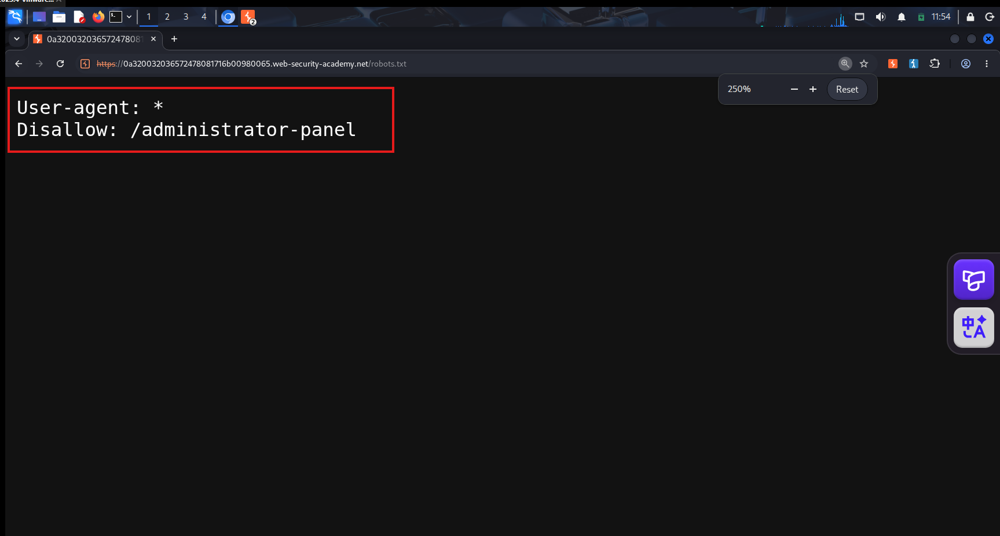

Phát hiện đường dẫn đến trang quản trị viên.

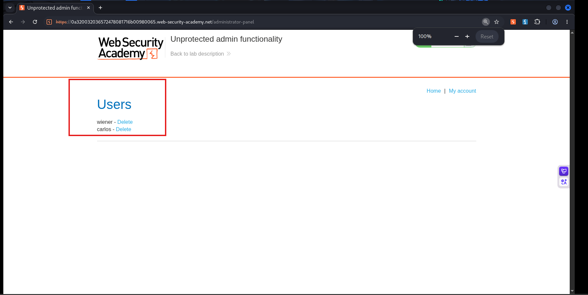

Thấy ngay danh sách user trên web cũng như nút xóa tài khoản.

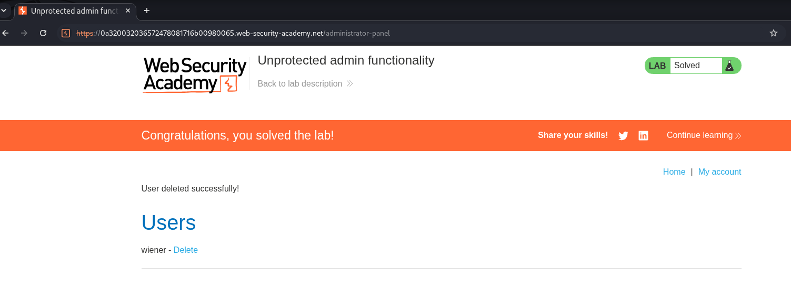

Em click xóa tài khoản và thành công hoàn thành xong bài lab này.

# Lab: Unprotected admin functionality with unpredictable URL

This lab has an unprotected admin panel. It's located at an unpredictable location, but the location is disclosed somewhere in the application.
> Lab này có bảng quản trị không được bảo vệ. Nó nằm ở một vị trí không thể đoán trước, nhưng vị trí đó được tiết lộ ở đâu đó trong ứng dụng.

Solve the lab by accessing the admin panel, and using it to delete the user carlos.
> Giải quyết bài thí nghiệm bằng cách truy cập bảng quản trị và sử dụng nó để xóa người dùng carlos.

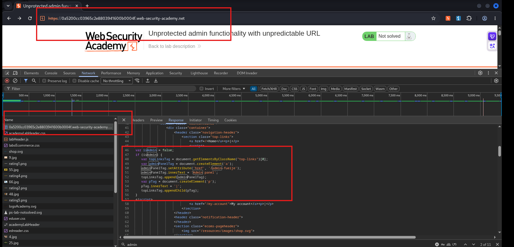

E đọc source html của web phát hiện lộ URL nhạy cảm đến chức năng quản trị là ```/admin-fueije```

E tiến hành truy cập và xóa user thành công.

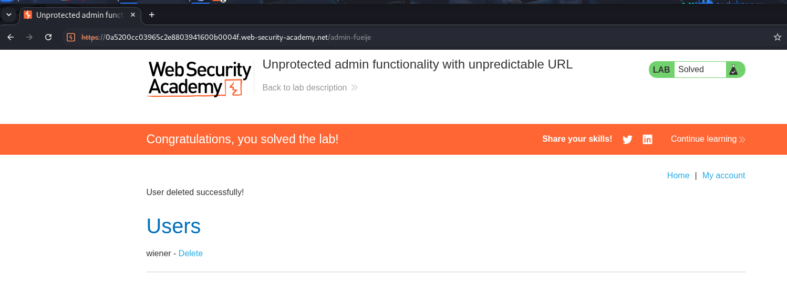

Lab: User role controlled by request parameter

This lab has an admin panel at /admin, which identifies administrators using a forgeable cookie.
> Lab này có bảng quản trị tại /admin, bảng này xác định các quản trị viên sử dụng cookie có thể giả mạo.

Solve the lab by accessing the admin panel and using it to delete the user carlos.
> Giải quyết bài thí nghiệm bằng cách truy cập bảng quản trị và sử dụng nó để xóa người dùng carlos.

You can log in to your own account using the following credentials: wiener:peter
> Bạn có thể đăng nhập vào tài khoản của mình bằng thông tin đăng nhập sau: wiener:peter

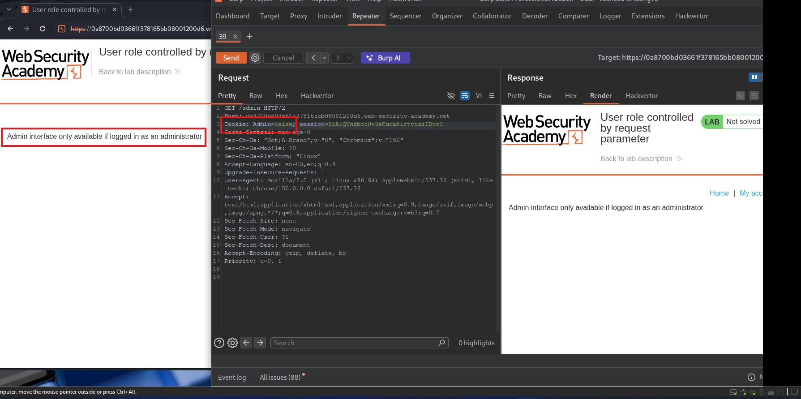

Sau khi đăng nhập bằng tài khoản được cấp, e tiến hành truy cập vào trang quản trị. Phát hiện ở đây dùng có 1 giá trị Cookie là ````Admin=false```. E tiến hành đổi thành true và thành công truy cập được vào tài khoản admin.

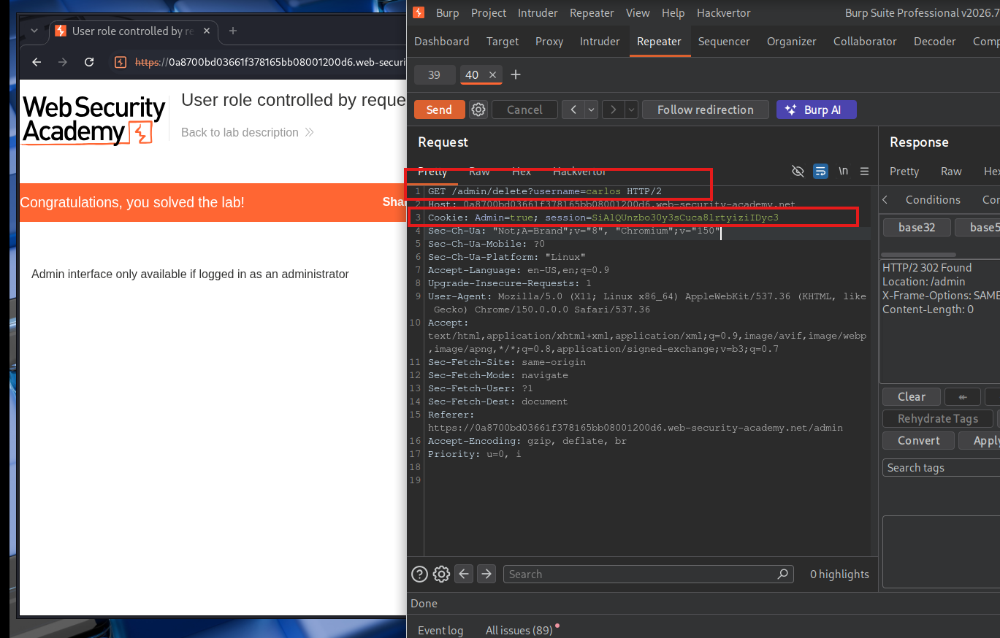

Mới đầu e thử xóa user carlos tại lúc sửa Cookie xong rồi paste reponse vô brower để xóa nhưng không thành công. Lúc sau e thêm Cookie vô request đó thì đã thành công xóa user carlos.

# Lab: User role can be modified in user profile

This lab has an admin panel at /admin. It's only accessible to logged-in users with a roleid of 2.
> Lab này có bảng quản trị tại /admin. Nó chỉ có thể truy cập được đối với người dùng đã đăng nhập với roleid là 2.

Solve the lab by accessing the admin panel and using it to delete the user carlos.
> Giải quyết bài thí nghiệm bằng cách truy cập bảng quản trị và sử dụng nó để xóa người dùng carlos.

You can log in to your own account using the following credentials: wiener:peter
> Bạn có thể đăng nhập vào tài khoản của mình bằng thông tin đăng nhập sau: wiener:peter

Ở bài này, sau khi e đăng nhập và thử các chức năng thông thường thì không thấy có gì hay ho. Nhưng đến khi e tiến hành Update email và intercept requests

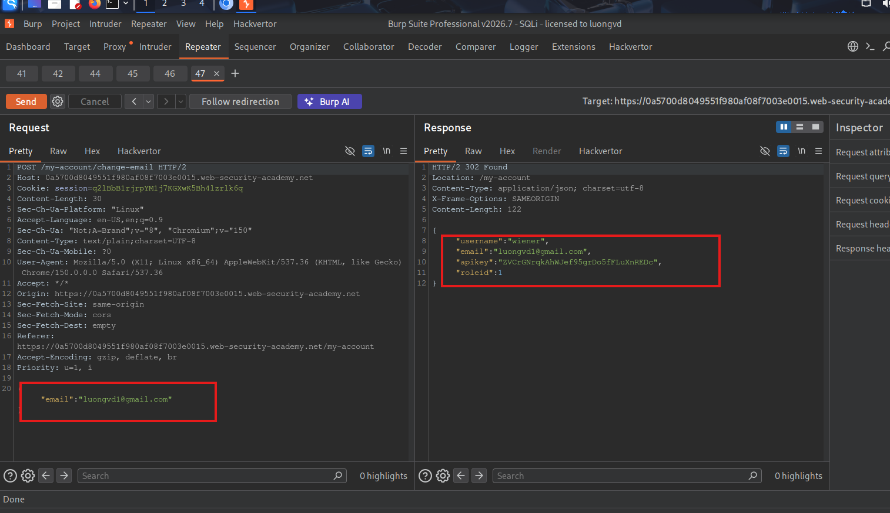

Tại đây e thấy khi request sẽ kèm json với email cần đổi, nhưng vấn đề nhiều code sẽ ẩu, lấy hết các trường bên trong rồi gán lại, đổi lại. E tiến hành thêm trường roleid với giá trị mới là 2.

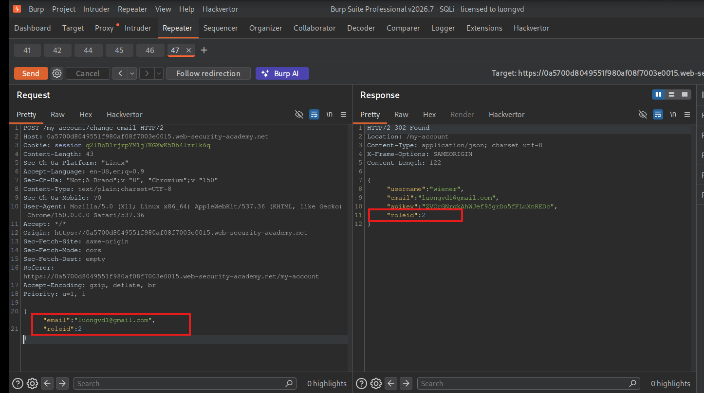

Như vậy e đã tiến hành đổi thành công roleid cho acc wiener này. E tiến hành truy cập admin panel tại /admin và xóa user.

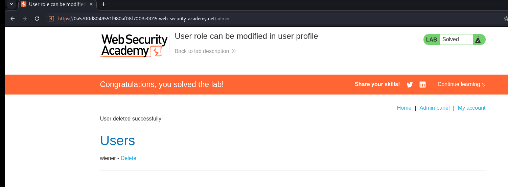

# Lab: URL-based access control can be circumvented

This website has an unauthenticated admin panel at /admin, but a front-end system has been configured to block external access to that path. However, the back-end application is built on a framework that supports the X-Original-URL header.
> Trang web này chứa lổ hổng kiểm soát truy cập /admin nhưng front-end đã chặn truy cập vào đường dẫn này. Tuy nhiên, phần back-end được xây dựng trên 1 framework hỗ trợ tiêu đề X-Original-URL.

To solve the lab, access the admin panel and delete the user carlos.
> Để giải quyết bài lab, truy cập đến admin panel và xóa user carlos.

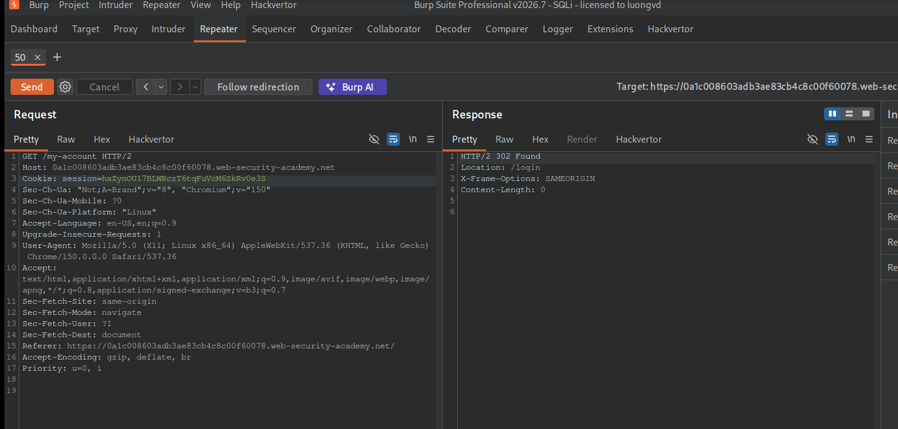

E truy cập vào endpoint api /admin nhận được 302 Not Found.

E tiến hành thêm trường X-Original-URL: /admin và request lại và thành công nhận được 200 OK. Tuy nhiên khi thử xóa thì lại không thành công.

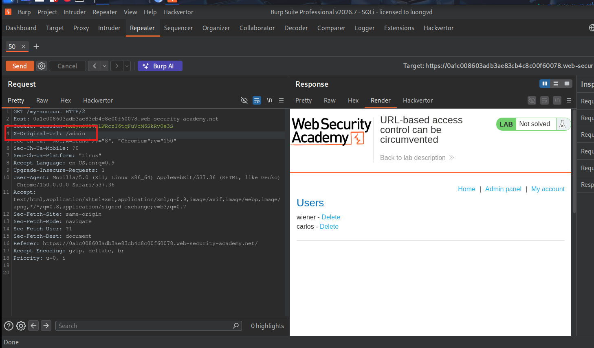

Sau đó e tiếp tục đổi sang endpoint ```GET /?username=carlos HTTP/2``` với X-Original-Url: /admin/delete vậy là e đã thành công làm xong bài lab.

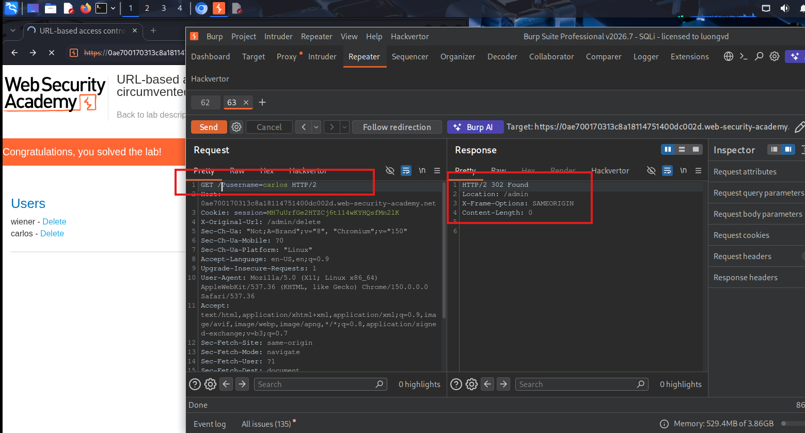

# Lab: Method-based access control can be circumvented

This lab implements access controls based partly on the HTTP method of requests. You can familiarize yourself with the admin panel by logging in using the credentials administrator:admin.
> Lab này triển khai các biện pháp kiểm soát quyền truy cập một phần dựa trên phương thức yêu cầu HTTP. Bạn có thể làm quen với bảng quản trị bằng cách đăng nhập bằng thông tin đăng nhập administrator:admin.

To solve the lab, log in using the credentials wiener:peter and exploit the flawed access controls to promote yourself to become an administrator.
> Để giải quyết bài thí nghiệm, hãy đăng nhập bằng thông tin xác thực wiener:peter và khai thác các biện pháp kiểm soát truy cập thiếu sót để thăng tiến bản thân trở thành administrator.

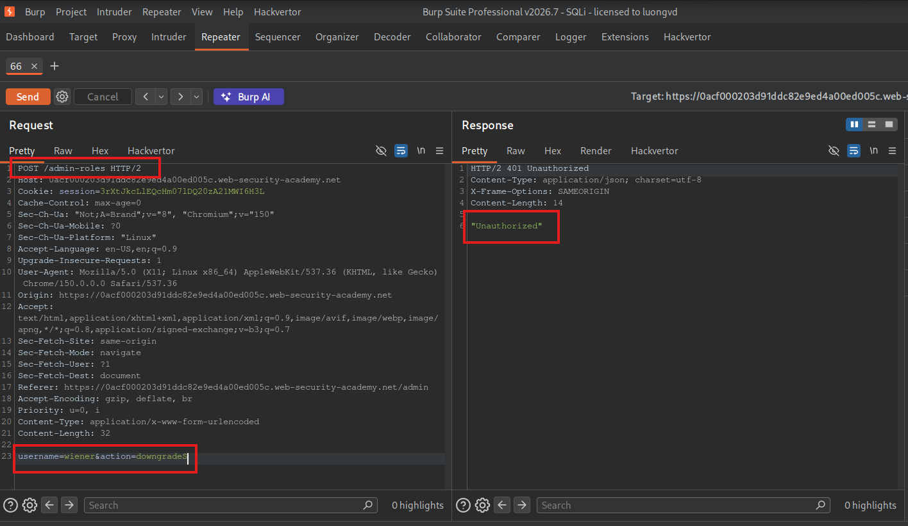

Sử dụng tài khoản administrator:admin để truy cập vào admin panel và tìm hiểu về chức năng của nó.  

Tại đây nó thực hiện POST tại endpoint `/admin-roles` với `username=wiener&action=downgrade` hoặc `username=wiener&action=upgrade`.

Sau đó e tiến hành đổi method thành GET và request lại thì nhận được 302 Found. Thành công upgrade lên admin.

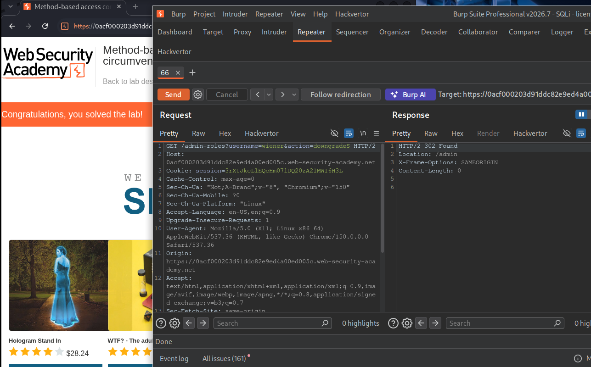

# Lab: User ID controlled by request parameter

This lab has a horizontal privilege escalation vulnerability on the user account page.
> Lab này có lỗ hổng leo thang đặc quyền theo chiều ngang trên trang tài khoản người dùng.

To solve the lab, obtain the API key for the user carlos and submit it as the solution.
> Để giải quyết bài thí nghiệm, hãy lấy khóa API cho người dùng carlos và submit.

You can log in to your own account using the following credentials: wiener:peter
> Bạn có thể đăng nhập vào tài khoản của mình bằng thông tin đăng nhập sau: wiener:peter

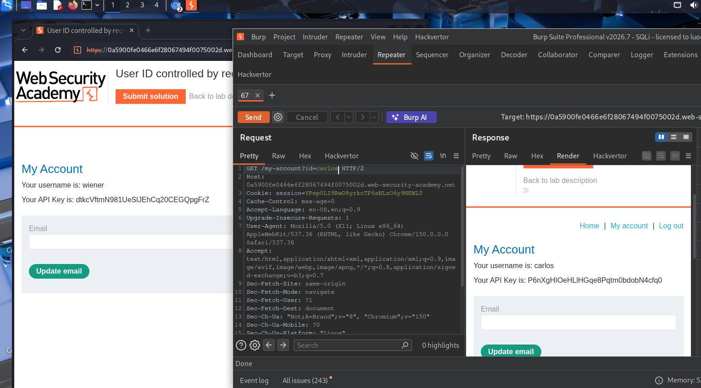

Tại endpoint /my-account?id=wiener e đổi thành /my-account?id=carlos và thành công lấy được API Key của carlos. 

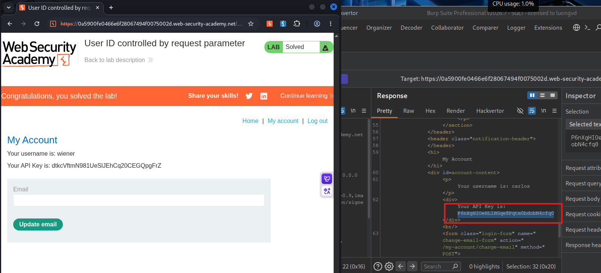

# Lab: User ID controlled by request parameter, with unpredictable user IDs

This lab has a horizontal privilege escalation vulnerability on the user account page, but identifies users with GUIDs.
> Lab này có lỗ hổng leo thang đặc quyền theo chiều ngang trên trang tài khoản người dùng nhưng xác định người dùng bằng GUID.

To solve the lab, find the GUID for carlos, then submit his API key as the solution.
> Để giải quyết bài thí nghiệm, hãy tìm GUID cho Carlos, sau đó gửi khóa API của anh ấy để submit.

You can log in to your own account using the following credentials: wiener:peter
> Bạn có thể đăng nhập vào tài khoản của mình bằng thông tin đăng nhập sau: wiener:peter

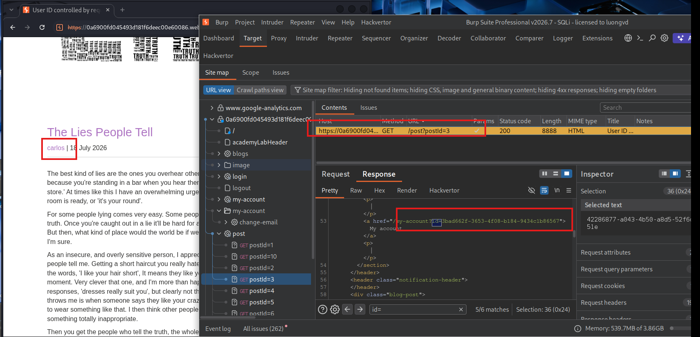

Truy cập một bài viết xác định được bài viết có tác giả carlos, bên trong source html, e phát hiện ra id của tác giả, tức là id của carlos.

E tiến hành đổi trong endpoint ```/my-account?id=``` và thành công tìm ra được api key của carlos.

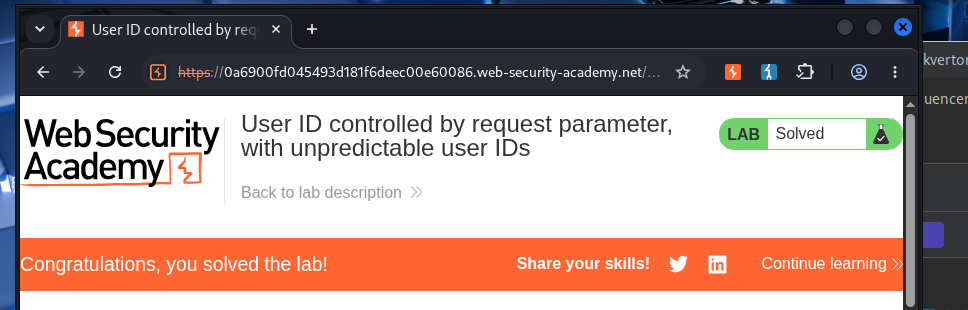

# Lab: Insecure direct object references

This lab stores user chat logs directly on the server's file system, and retrieves them using static URLs.
> Lab này lưu trữ nhật ký trò chuyện của người dùng trực tiếp trên hệ thống tệp của máy chủ và truy xuất chúng bằng URL tĩnh.

Solve the lab by finding the password for the user carlos, and logging into their account.
> Giải quyết bài thí nghiệm bằng cách tìm mật khẩu của người dùng Carlos và đăng nhập vào tài khoản của họ.

Tại phần tải chat endpoint `/download-transcript/` e thấy sau khi e thử chat và tải xuống thì kịch bản này bắt đầu từ 2.txt. E đoán như vậy sẽ còn lại file 1.txt. E tiến hành Repeater và đổi thành 1.txt.

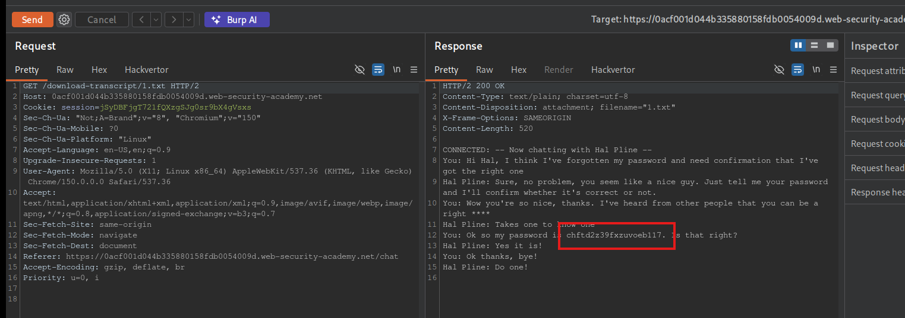

Tại nội dung đoạn chat, e thu được một giá trị mật khẩu, e tiến hành đăng nhập tài khoản carlos và thành công truy cập tài khoản.

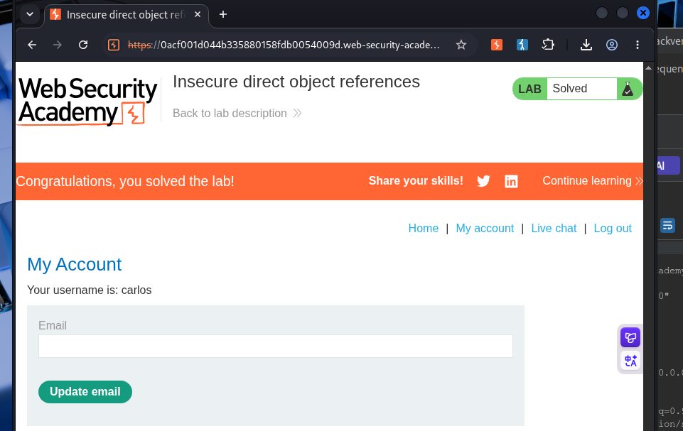

# Lab: Multi-step process with no access control on one step

This lab has an admin panel with a flawed multi-step process for changing a user's role. You can familiarize yourself with the admin panel by logging in using the credentials administrator:admin.
> Phòng thí nghiệm này có bảng quản trị với quy trình gồm nhiều bước chưa hoàn thiện để thay đổi vai trò của người dùng. Bạn có thể làm quen với bảng quản trị bằng cách đăng nhập bằng thông tin đăng nhập administrator:admin.

To solve the lab, log in using the credentials wiener:peter and exploit the flawed access controls to promote yourself to become an administrator.
> Để giải quyết bài thí nghiệm, hãy đăng nhập bằng thông tin xác thực wiener:peter và khai thác các biện pháp kiểm soát truy cập thiếu sót để thăng tiến bản thân trở thành administrator.

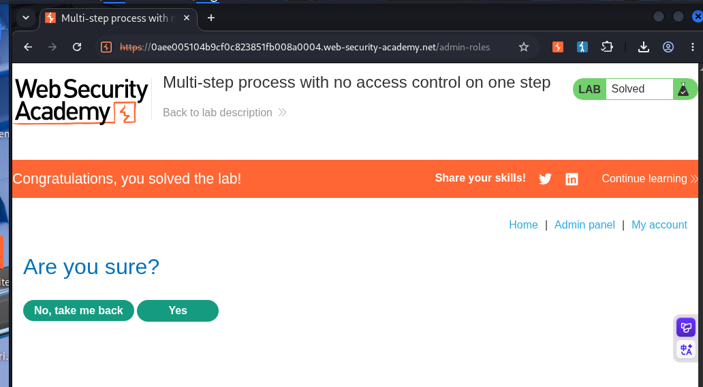

Khi update một user lên admin với tài khoản admin chúng ta thấy có thông báo xác nhận, một request xác nhận 

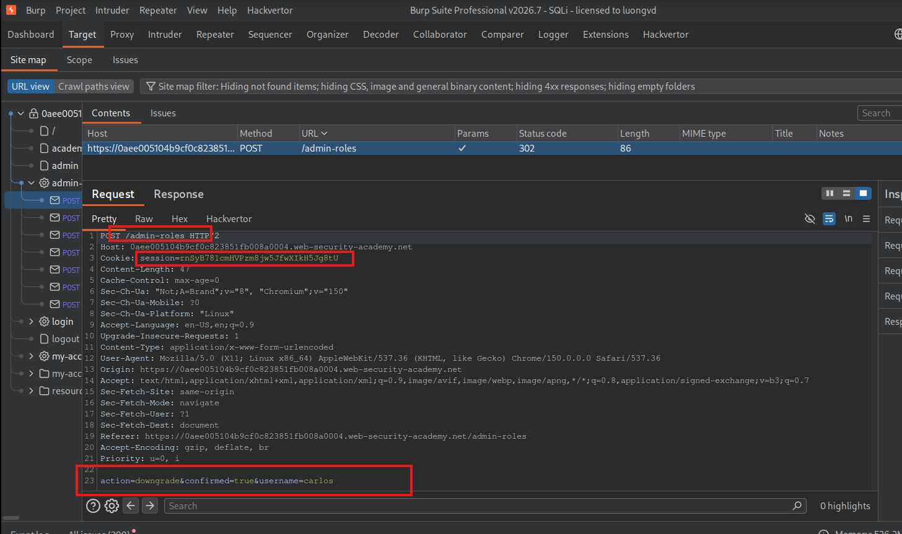

Vấn đề xảy ra là khi ở bước confirm này, trang web lại không kiểm tra dẫn đến việc chúng ta có thể thay thế session khác của user bình thường mà việc nâng quyền vẫn được xảy ra bình thường.

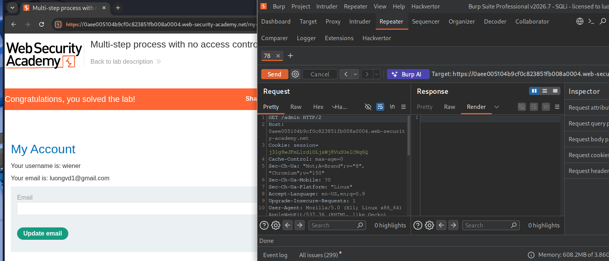

E chuyển request xác nhận đó sang bên Repeater rồi thay thế với session của wiener để nâng cấp quyền cho wiener, và sau đó đăng nhập lại tài khoản wiener thì đã thành công nâng cấp quyền. 

# Lab: Referer-based access control

This lab controls access to certain admin functionality based on the Referer header. You can familiarize yourself with the admin panel by logging in using the credentials administrator:admin.
> Lab này kiểm soát quyền truy cập vào chức năng quản trị nhất định dựa trên Referer header. Bạn có thể làm quen với bảng quản trị bằng cách đăng nhập bằng thông tin đăng nhập administrator:admin.

To solve the lab, log in using the credentials wiener:peter and exploit the flawed access controls to promote yourself to become an administrator.
> Để giải quyết bài thí nghiệm, hãy đăng nhập bằng thông tin xác thực wiener:peter và khai thác các biện pháp kiểm soát truy cập thiếu sót để thăng tiến bản thân trở thành quản trị viên.

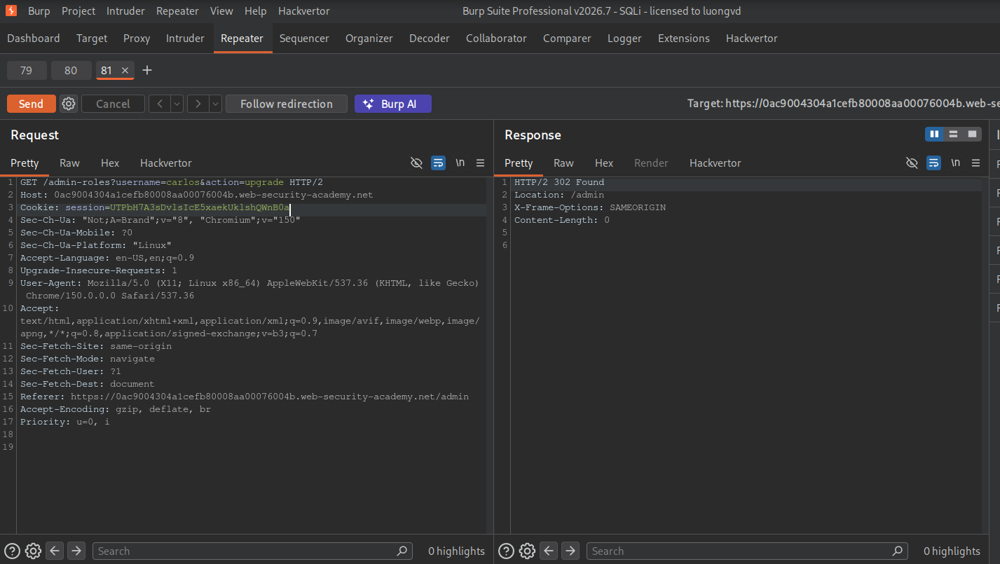

Khi vào tài khoản quản trị viên e tiến hành vào trang admin và upgrade username thử. 

Nhận được request e chuyển tiếp vào Repeater, e tiến hành thay username thành wiener và thay thế cookie session của wiener mới được đăng nhập thành công vô.

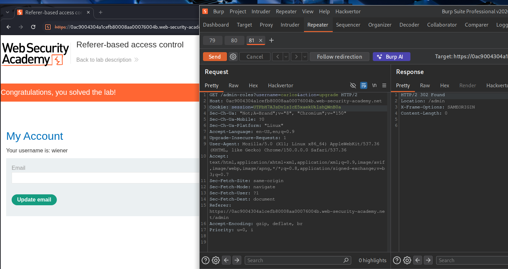

Như vậy là e đã lên thành công được admin.