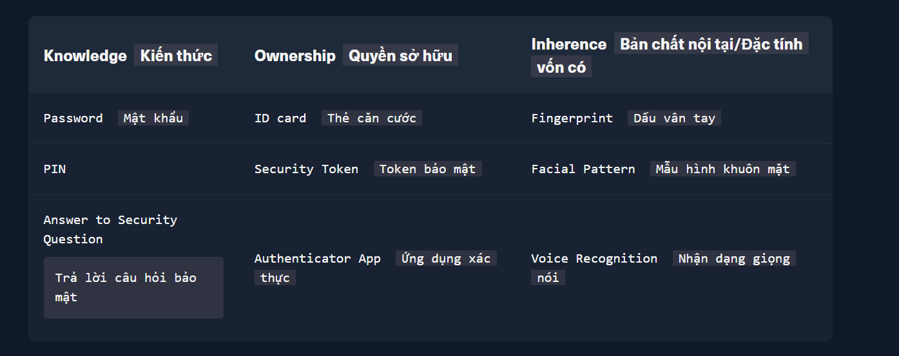
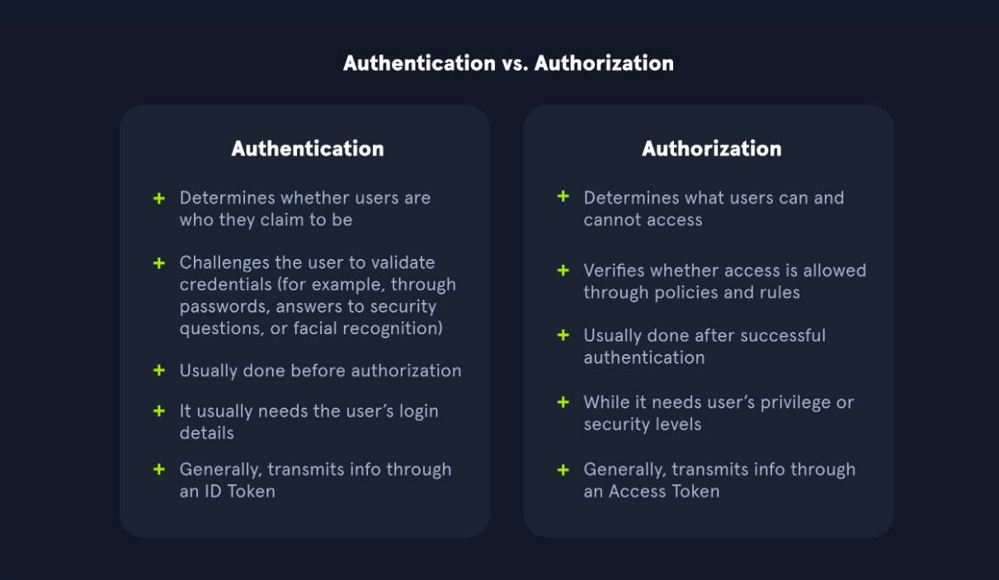

# Authentication vulnerabilities 
# Lỗ hỗng xác thực 

## What is authentication ? 
> Xác thực là gì ?  

Authentication is the process of verifying the identity of a user or client. Websites are potentially exposed to anyon who is connected to the internet. This makes robust authentication mechanisms integral to effective web security. 

> Xác thực là quá trình xác minh danh tính của người dùng hoặc khách hàng. Các trang web có khả năng bị lộ cho bất kỳ ai được kết nối với internet. Điều này làm cho các cơ chế xác thực mạnh mẽ trở nên không thể thiếu để bảo mật web hiệu quả.

## There are three main types of authentication:
> Có ba loại xác thực chính:

- Something you know, such as a password or the answer to a security question. These are sometimes called "knowledge factors"
  > Những gì bạn biết, chẳng hạn như mật khẩu hoặc câu trả lời bảo mật. Đôi khi chúng được gọi là "yếu tố tri thức". 
- Something you have, This is a physical object such as a mobile phone or security token. These are sometimes called "possession factors".
  > Những gì bạn có. Đồ vật như điện thoại hoặc mã khóa bảo mật. 
  Đôi khi chúng còn được gọi là "yếu tố sở hữu"
- Something you are or do. For example, your biometrics or patterns of behavior. These are sometimes called "inherence factors"
  > Những gì chứng minh là bạn hoặc bạn đang làm. Ví dụ sinh trắc học hoặc mô tả hành vi của bạn. Đó còn được gọi là yếu tố cố hữu tức là có sẵn rồi.

Authentication mechanisms rely on a range of technologies to verify one or more of these factors. 
> Cơ chế xác thực dựa trên một loại các công nghệ để xác định một hoặc nhiều yếu tố này.

## What is the difference between authentication and authorization ? 
> Sự khác nhau giữa xác thực và phân quyền là gì?

Authentication is the process of verifying that a user is who they claim to be. Authorization involves verifying whether a user is allowed to do something.
> Xác thực là quá trình xác thực người dùng là ai. Còn phân quyền liên quan đến việc xác minh xem người dùng có được phép làm gì hay không.

Once Carlos123 is authenticated, their permissions determine what they are authorized to do. For example, they may be authorized to access personal information about other users, or perform actions such as deleting another user's account.
> Sau khi Carlos123 được xác thực, quyền hạn của người dùng sẽ xác định những gì người dùng đó được phép làm. Ví dụ, họ có thể được cấp quyền truy cập thông tin cá nhân của người dùng khác, hoặc thực hiện các hành động như xóa tài khoản người dùng khác.   

## How do authentication vulnerabilities arise ?
> Lỗ hổng xác thực này phát sinh thế nào 

Most vulnerabilities in authentication mechanisms occur in one of two ways:
> Hầu hết các lỗ hổng trong các cơ chế xác thực đều xảy ra 1 trong 2 cách sau:

- The authentication mechanisms are weak because they fail to adequately protect against brute-force attacks. 
  > Các cơ chế xác thực yếu kém không chống lại được các cuộc tấn công brute-force.

- Logic flaws or poor coding in the implementation allow the authenticaion mechanisms to be bypassed entirely by an attacker. This is sometimes called "broken authentication"
  > Những lỗi về mặt logic hoặc cách lập trình kém trong quá trình triển khai khiến các cơ chế xác thực có thể bị kẻ tấn công vượt qua một cách dễ dàng. Tình huống này còn được gọi là "broken authentication".

In many area of web development, logic flaws cause the website to behave unexpectedly, which may or may not be an security issue. However, as authentication is so critical to security, it's very likely that flawed authentication logic exposes the website to securiy issues. 
> Trong nhiều lĩnh vực của việc phát triển web, các lỗi về mặt logic có thể khiến trang web hoạt động bất thường. Điều này có thể là về vấn đề bảo mật, hoặc cũng có thể không phải vậy. Tuy nhiên vì việc xác xác thực người dùng đóng vai trò quan trọng trong việc đảm bảo an ninh, nên rất có thể những lỗi trong quy trình xác thực sẽ khiến trang web dễ bị tấn công từ phía kẻ xấu.

## What is the impact of vulnerable authentication ? 
> Tác động của lỗ hổng xác thực ?

The impact of authentication vulnerabilities can be severe. If an attacker bypasses authentication or brute-forces their way into another user's account, they have access to all the data and functionality that the compromised account has. If they are able to compromise a high-priviledged account, such as a system administrator, they could take full control over the entire application and potentially gain access to internal infrastructure. 
> Tác động của lỗ hổng xác thực có thể nghiêm trọng . Nếu kẻ tấn công bỏ qua xác thực hoặc tấn công vào tài khoản của người dùng khác, họ có thể có quyền truy cập vào tất cả dữ liệu và tính năng mà tài khoản đó có. Nếu xâm phạm một tài khoản có đặc quyền cao, chẳng hạn như quản trị viên hệ thống, họ có thể kiểm soát toàn bộ ứng dụng và có khả năng truy cập vào hạ tầng nội bộ.

Even compromising a low-privileged account might still grant an attacker access to data that they otherwise shouldn't have, such as comercially sensitive business information. Even if the account does not have access to any sensitive data, it might still allow the attacker to access additional pages, which provide a further attack surface. Often, high-severity attacks are not possible from publicly accessible pages, but they may be possible from an internal page. 
> Ngay cả việc xâm phạm một tài khoản có đặc quyền thấp vẫn có thể cấp cho kẻ tấn công quyền truy cập vào dữ liệu mà chúng không nên có, chẳng hạn như thông tin kinh doanh nhạy cảm về mặt thương mại. Ngay cả khi tài khoản không có quyền truy cập vào bất kỳ dữ liệu nhạy cảm nào, nó vẫn có thể cho phép kẻ tấn công truy các các trang bổ sung, cung cấp nền tảng cho các cuộc tấn công khác. Thông thường, các cuộc tấn công có mực độ nghiệm trọng cao không thể thực hiện từ các trang có thể truy cập công khai, nhưng chúng có thể xảy ra từ một trang nội bộ.

## Vulnerable in authentication mechanisms 
> Lỗ hổng trong cơ chế xác thực

A website's authentication system usually consists of several distinct mechanisms where vulnerabilities may occur. Some vulnerabilities are applicable across all of these contexts. Other are more specific to the functionality provided.
> Hệ thống xác thực của một website thường bao gồm nhiều cơ chế riêng biệt, và ở mỗi cơ chế đều có thể tồn tại các lỗ hổng bảo mật. Một số lỗ hổng có thể xuất hiện trong mọi cơ chế này, trong khi những lỗ hổng khác chỉ liên quan đến một chức năng hoặc cơ chế cụ thể mà hệ thống cung cấp.

We will look more closely at some of the most commom vulnerabilities in the following areas:
> Chúng ta sẽ xem xét kỹ hơn một số lỗ hổng phổ biến trong các lĩnh vực sau:

- Vulnerabilities in password-based login 
> Lỗ hổng đăng nhập dựa trên mật khẩu.

[Vulnerabilities in password-based login](<Vulnerabilities in password-based login.md>)

- Vulnerabilities in multi-factor authentication
> Lỗ hổng xác thực đa yếu tố.

[Vulnerabilities in multi-factor authentication](<Vulnerabilities in multi-factor authentication.md>)

- Vulnerabilities in other authentication mechanisms
> Lỗ hổng trong các cơ chế xác thực khác.

[Vulnerabilities in other authentication mechanisms](<Vulnerabilities in other authentication mechanisms.md>) 

[Lab](Lab.md)