# Lab: File path traversal, simple case

This lab contains a path traversal vulnerability in the display of product images.
> Lab này chứa lỗ hổng truyền tải đường dẫn trong việc hiển thị hình ảnh sản phẩm.

To solve the lab, retrieve the contents of the /etc/passwd file.
> Để giải bài lab, hãy truy xuất nội dung của tệp /etc/passwd.

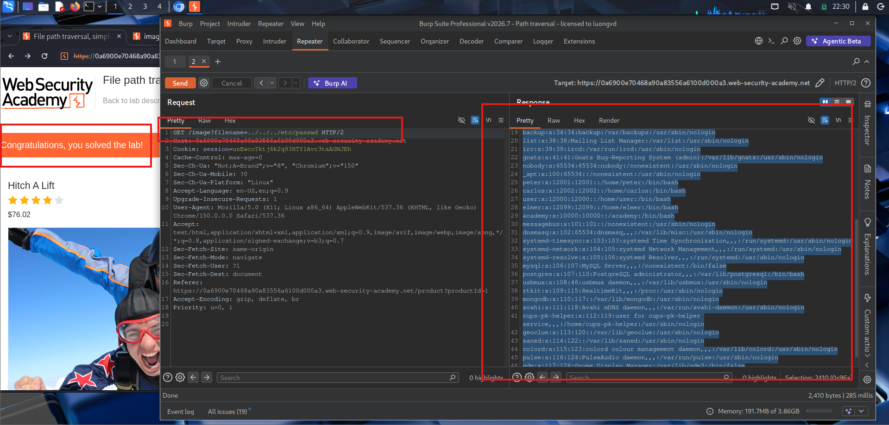

Truy cập một đường dẫn ảnh ở trong bài viết e lần lượt thêm ../ và nối với /etc/passwd e thử thêm lần lượt và đúng ba chuỗi ../ được thêm vào em đã đọc được thành công file /etc/passwd và thành công giải được bài lab này.

# Lab: File path traversal, traversal sequences blocked with absolute path bypass

This lab contains a path traversal vulnerability in the display of product images.
> Lab này chứa lỗ hổng path traversal trong việc hiển thị hình ảnh sản phẩm.

The application blocks traversal sequences but treats the supplied filename as being relative to a default working directory.
> Ứng dụng chặn các chuỗi truyền tải nhưng coi tên tệp được cung cấp có liên quan đến thư mục làm việc mặc định.

To solve the lab, retrieve the contents of the /etc/passwd file.
> Để giải bài lab, hãy truy xuất nội dung của tệp /etc/passwd.

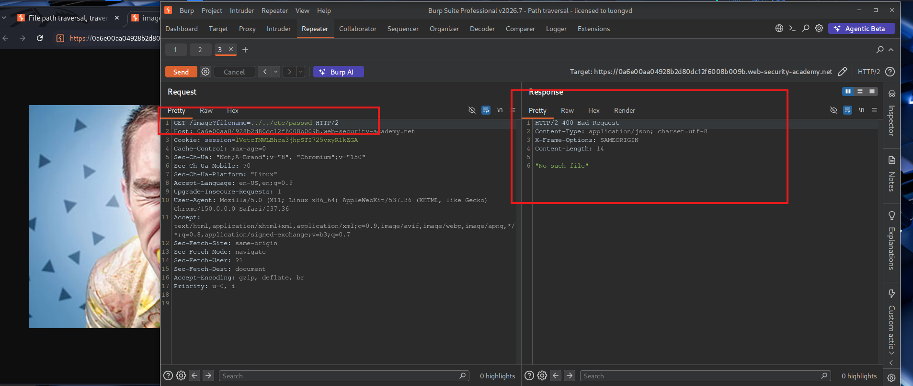

Khi tiến hành thử như bài trước, ứng dụng đã chặn chuỗi '../' và không cho phép truy cập vào tệp /etc/passwd như bài trước nữa.    

E tiến hành đổi thử từ đường dẫn tương đối sang đường dẫn tuyệt đối và thành công giải bài lab này.

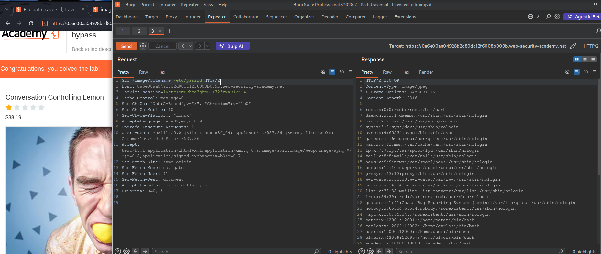

# Lab: File path traversal, traversal sequences stripped non-recursively

This lab contains a path traversal vulnerability in the display of product images.
> Lab này chứa lỗ hổng path traversal trong việc hiển thị hình ảnh sản phẩm.

The application strips path traversal sequences from the user-supplied filename before using it.
> Ứng dụng loại bỏ các chuỗi path traversal khỏi tên tệp do người dùng cung cấp trước khi sử dụng.

To solve the lab, retrieve the contents of the /etc/passwd file.
> Để giải bài lab, hãy truy xuất nội dung của tệp /etc/passwd.

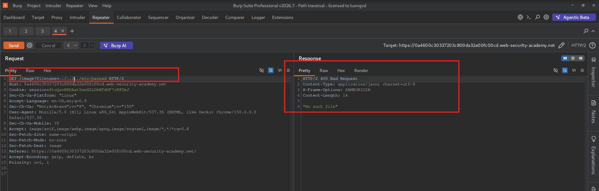

Khi sử dụng chuỗi `../` và đường dẫn tuyệt đối đều không hoạt động. Lúc này server đã có filter khi nhận request. Phần filter này có thể chỉ đơn giản là replace 1 lần các chuỗi `../` thành chuỗi rỗng.

Như vậy chỉ cần nhập chuỗi `....//` sẽ thành được `../` sau đó e tiếp tục thử nhiều lần.

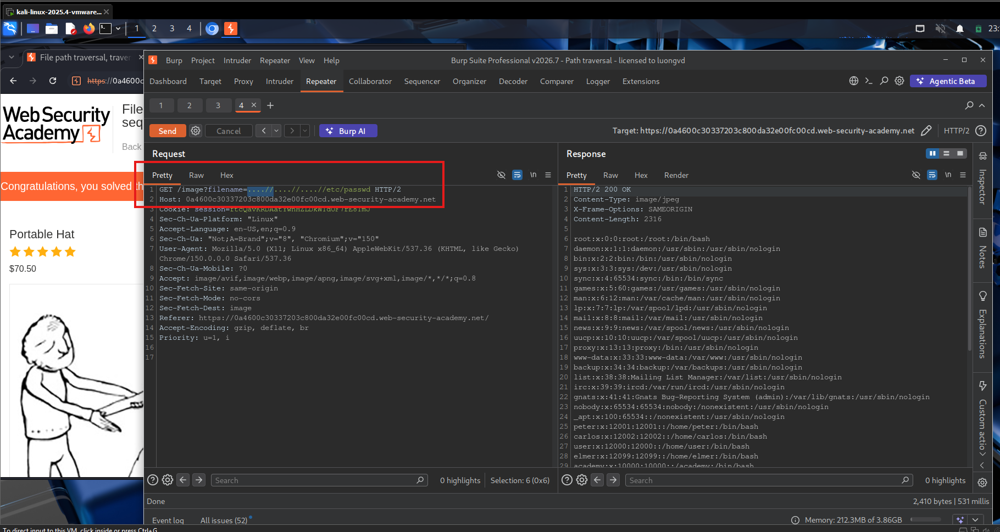

Như vậy sau 3 chuỗi `....//` e đã thành công giải được bài lab này. 

# Lab: File path traversal, traversal sequences stripped with superfluous URL-decode

This lab contains a path traversal vulnerability in the display of product images.
> Lab này chứa lỗ hổng path traversal trong việc hiển thị hình ảnh sản phẩm.

The application blocks input containing path traversal sequences. It then performs a URL-decode of the input before using it.
> Ứng dụng chặn đầu vào chứa các chuỗi path traversal. Sau đó, nó thực hiện giải mã URL của đầu vào trước khi sử dụng.

To solve the lab, retrieve the contents of the /etc/passwd file.
> Để giải bài lab, hãy truy xuất nội dung của tệp /etc/passwd.

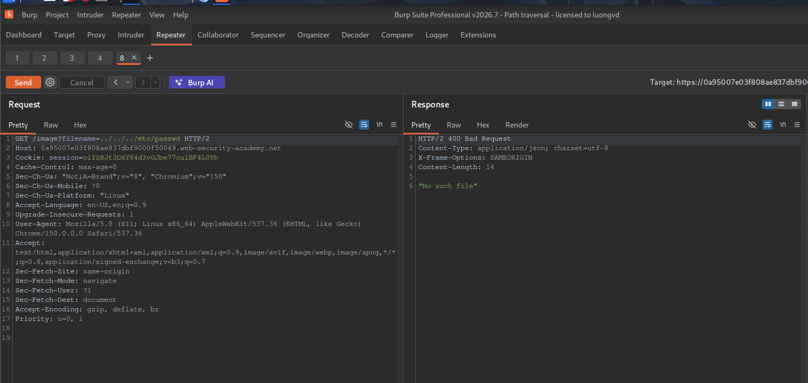

Thử với payload đơn giản và có thêm lặp lại thử cũng không vượt qua được.

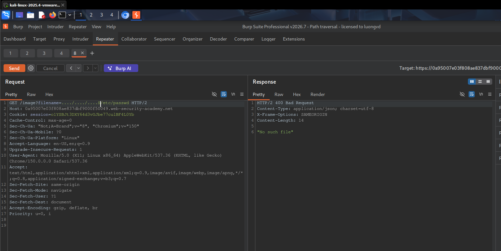

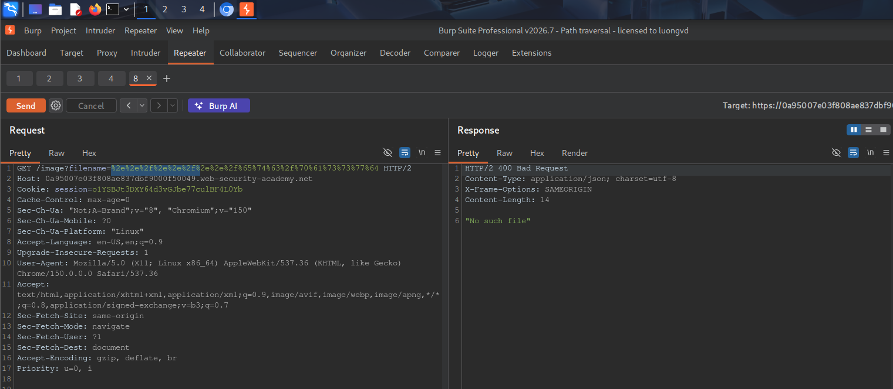

Khi thử thêm 1 lần URL encode vẫn không vượt qua được. Khi thử 2 lần URL encode em đã thành công vượt qua bài lab này.

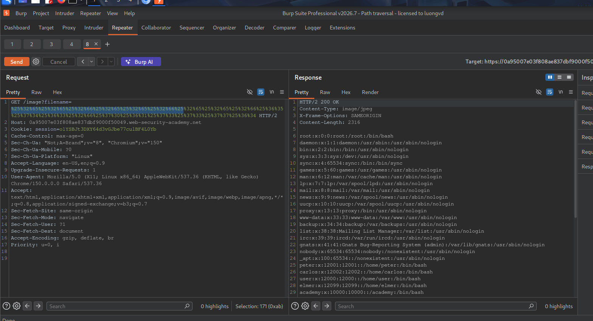

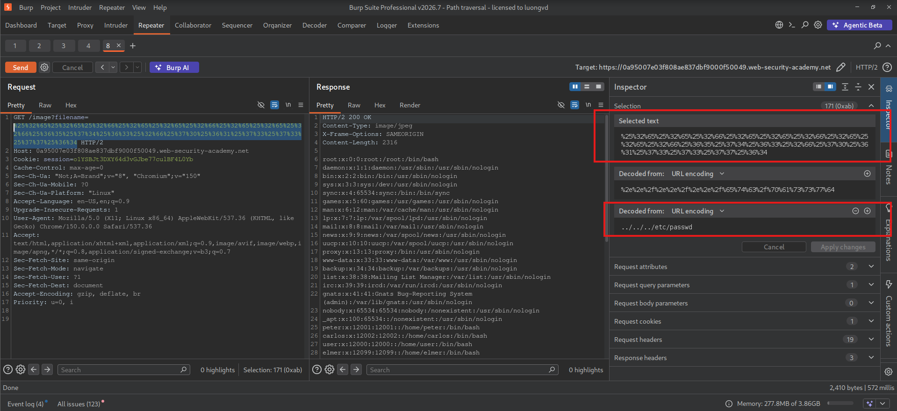

Thành công với payload gốc là `../../../etc/` với 2 lần URL encode.

# Lab: File path traversal, validation of start of path

This lab contains a path traversal vulnerability in the display of product images.
> Lab này chứa lỗ hổng path traversal trong việc hiển thị hình ảnh sản phẩm.

The application transmits the full file path via a request parameter, and validates that the supplied path starts with the expected folder.
> Ứng dụng truyền toàn bộ đường dẫn tệp thông qua tham số request và xác thực rằng đường dẫn được cung cấp bắt đầu bằng thư mục dự kiến.  

To solve the lab, retrieve the contents of the /etc/passwd file.
> Để giải bài lab, hãy truy xuất nội dung của tệp /etc/passwd.

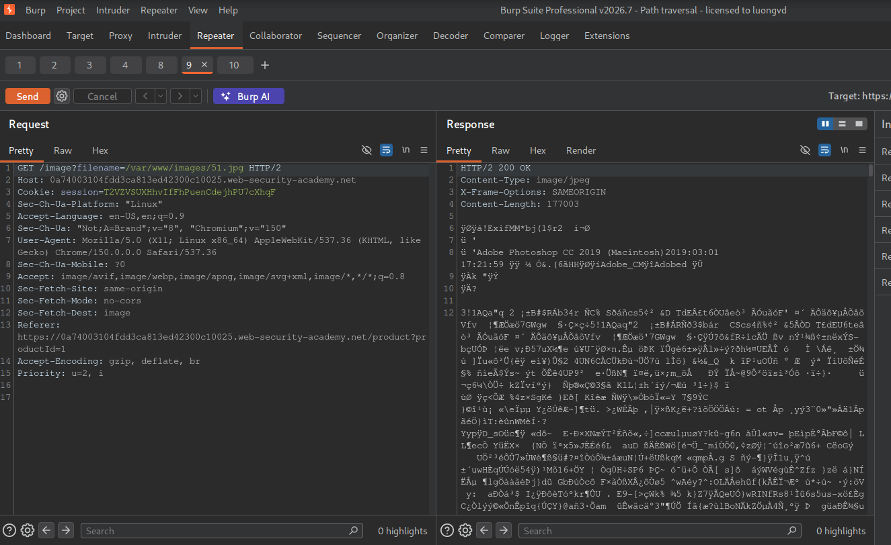

Tại đây e lần lượt thử thêm các cặp `../` và khi thử đến 3 chuỗi liên tiếp e đã thành công vượt qua được bài lab này.

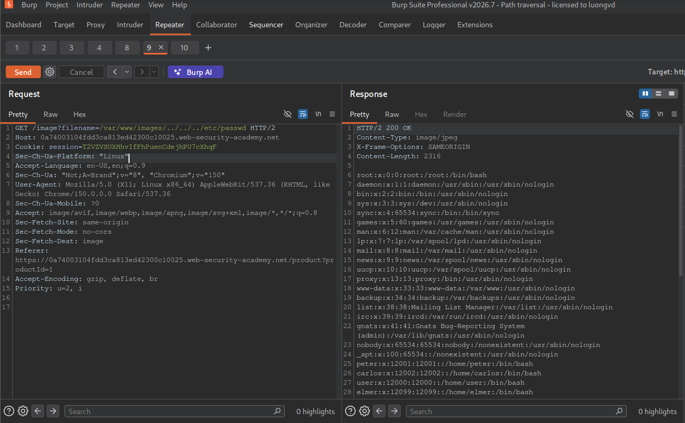 

# Lab: File path traversal, validation of file extension with null byte bypass

This lab contains a path traversal vulnerability in the display of product images.
> Lab này chứa lỗ hổng path traversal trong việc hiển thị hình ảnh sản phẩm.

The application validates that the supplied filename ends with the expected file extension.
> Ứng dụng xác thực rằng tên tệp được cung cấp kết thúc bằng phần mở rộng tệp dự kiến.

To solve the lab, retrieve the contents of the /etc/passwd file.
> Để giải bài lab, hãy truy xuất nội dung của tệp /etc/passwd.

Tại phần này e tiếp tục sử dụng `../` nhưng không thu được kết quả. Ở bài này filter kiểm tra kết thúc của file name có là đuôi phù hợp hay không.

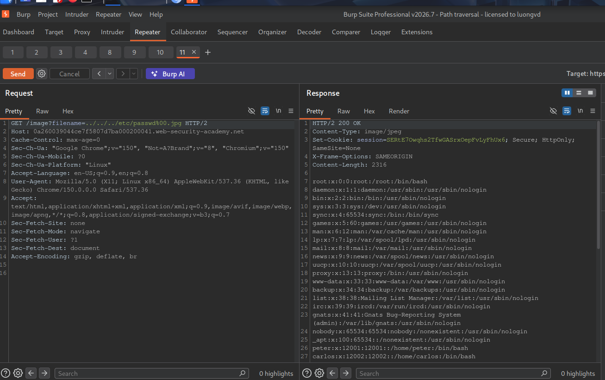

E sử dụng .jpg kết hợp với `%00` (null byte) để giải quyết bài lab này. Vì `%00` giúp cắt chuỗi đi chỉ còn lại path chúng ta mong muốn đọc.

